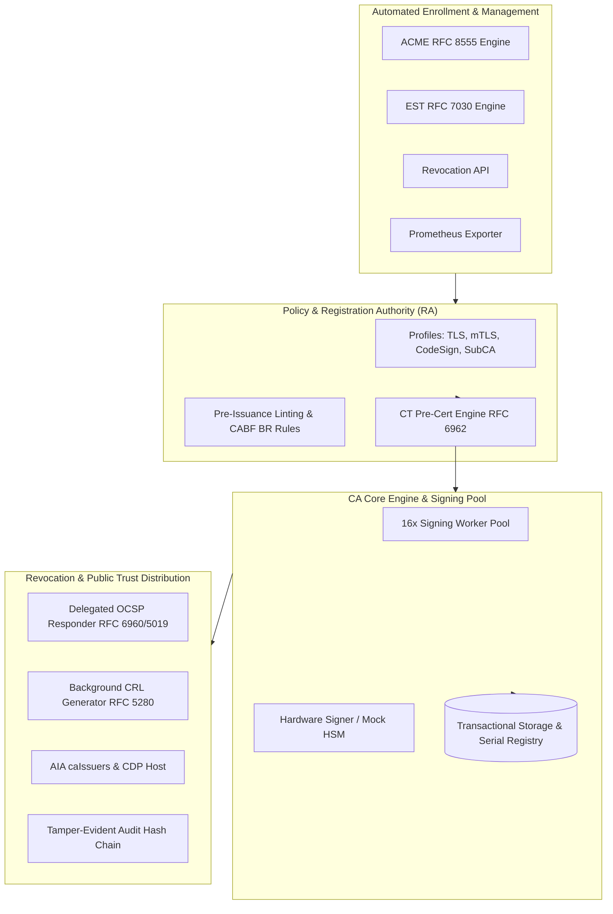

# go-certa: Enterprise Digital Certificate Authority & PKI System

[](https://pkg.go.dev/)
[](LICENSE)

A production-grade, educational Certificate Authority (CA) and Public Key Infrastructure (PKI) built from first principles in Go. Implements automated issuance protocols (ACME, EST), real-time status verification (OCSP, CRL), Certificate Transparency (CT), tamper-evident audit logging, and Prometheus observability.

---

## Architecture Overview



---

## Features & Standards Conformance

* **Core Trust Hierarchy & Profiles (RFC 5280)**:
  * Strict Root CA and Issuing Intermediate CA separation.
  * Profile engine enforcing KeyUsage, ExtKeyUsage, SAN constraints, and validity bounds (`ServerTLS`, `ClientAuth`, `CodeSigning`, `SubCA`).
  * Dynamic Authority Information Access (`id-ad-ocsp`, `id-ad-caIssuers`) and CRL Distribution Points (CDP).
  * Method (1) 160-bit SHA-1 Subject Key Identifiers (SKID) and Authority Key Identifiers (AKID).
* **Serial Number Entropy (RFC 5280 / CA/B Forum BR §7.1)**:
  * Cryptographically secure serial numbers with 128 bits of CSPRNG entropy (preventing chosen-prefix collision attacks like MD5 Rogue CA / Flame).
* **Automated Enrollment Protocols**:
  * **ACME (RFC 8555)**: Complete automated lifecycle (`/directory`, `Replay-Nonce`, `new-account`, `new-order`, `authz`, `challenge`, `finalize`, `cert`).
  * **EST (RFC 7030)**: Automated router/IoT enrollment via `/.well-known/est/cacerts` and `/simpleenroll`.
* **Revocation Status & Distribution**:
  * **Delegated OCSP Responder (RFC 6960 & RFC 5019)**: Ephemeral delegated signing certificate (`id-kp-OCSPSigning`), HTTP POST and RFC 5019 HTTP GET with `Cache-Control` / `ETag` / `If-None-Match` (HTTP 304) for CDN edge caching.
  * **CRL Distribution (RFC 5280 §5)**: Scheduled background Base CRL generator publishing to `/crl/intermediate.crl`.
  * **Revocation API**: REST endpoint (`POST /api/v1/revoke`) supporting standard RFC 5280 reason codes.
* **Certificate Transparency (RFC 6962)**:
  * 2-phase issuance: critical CT Poison extension (`1.3.6.1.4.1.11129.2.4.3`) on pre-certificates, CT log submission, and SCT list embedding (`1.3.6.1.4.1.11129.2.4.2`).
* **Observability & Cryptographic Audit**:
  * **Tamper-Evident Audit Log**: Append-only SHA-256 hash chain mathematically verified from genesis on every shutdown.
  * **Prometheus Metrics**: Live text exposition on `/metrics` tracking issuance throughput, OCSP hits, signing queue saturation, and rejections.

---

## Quick Start with Makefile

A `Makefile` is included for common operational workflows. Run `make help` to inspect available commands:

```bash
make help
```

### 1. Start the CA Server
```bash
make run
```
The server will boot on `http://localhost:8080`.

### 2. Run Tests
```bash
make test        # Run all unit and integration tests
make test-race   # Run tests with the Go race detector
make coverage    # Generate code coverage summary
```

---

## Step-by-Step Operations Guide

### 1. Download Trust Anchors & AIA Chains

Clients use AIA `caIssuers` to build the verification chain up to the trust anchor:

```bash
# Via AIA caIssuers endpoint
curl -s http://localhost:8080/ca/intermediate.crt --output intermediate.der
openssl x509 -in intermediate.der -inform der -text -noout

# Via EST cacerts endpoint
curl -s http://localhost:8080/.well-known/est/cacerts --output cacert.pem
```

---

### 2. Enroll a Certificate via EST (RFC 7030)

#### Option A: Using the Makefile
```bash
make enroll-est
```

#### Option B: Manual Enrollment
```bash
# 1. Generate private key and CSR
openssl req -new -newkey rsa:2048 -nodes \
  -keyout client.key \
  -out client.csr \
  -subj "/CN=client.example.com"

# 2. Base64-encode the DER CSR
openssl req -in client.csr -outform der | base64 > client.b64

# 3. Submit to EST SimpleEnroll
curl -s -X POST -d @client.b64 http://localhost:8080/.well-known/est/simpleenroll --output client.der

# 4. Inspect the issued certificate
openssl x509 -in client.der -inform der -text -noout
```

---

### 3. Real-Time Verification via OCSP (RFC 6960 & RFC 5019)

#### Option A: Using the Makefile
```bash
make check-ocsp
```

#### Option B: Binary POST with OpenSSL
```bash
openssl ocsp -issuer intermediate.der -cert client.der \
  -url http://localhost:8080/ocsp -text
```

#### Option C: RFC 5019 HTTP GET with Caching
```bash
# Create binary OCSP request
openssl ocsp -issuer intermediate.der -cert client.der -reqout ocsp.req

# Send HTTP GET query with base64url payload:
curl -i "http://localhost:8080/ocsp/$(openssl base64 -in ocsp.req | tr -d '\n' | tr '/+' '_-' | tr -d '=')"
```
Notice the `Cache-Control` and `ETag` headers. Sending `If-None-Match: "<etag>"` returns **HTTP 304 Not Modified**.

---

### 4. Revoke a Certificate & Verify Status

```bash
# 1. Extract the certificate serial number
openssl x509 -in client.der -inform der -serial -noout
# Example output: serial=4F9A2B3C...

# 2. Revoke via Revocation API (Reason: 1 = keyCompromise)
curl -s -X POST http://localhost:8080/api/v1/revoke \
  -H "Content-Type: application/json" \
  -d '{"serial": "4F9A2B3C...", "reason": 1}'

# 3. Re-query OCSP immediately to confirm revoked status
openssl ocsp -issuer intermediate.der -cert client.der -url http://localhost:8080/ocsp -text
```

---

### 5. Fetch Certificate Revocation Lists (CRL)

```bash
# Using Makefile
make fetch-crl

# Manual curl
curl -s http://localhost:8080/crl/intermediate.crl --output intermediate.crl
openssl crl -inform der -in intermediate.crl -text -noout
```

---

### 6. Automated Issuance via ACME (RFC 8555)

The server exposes standard RFC 8555 endpoints compatible with ACME clients (Certbot, Lego, Acme.sh):

```bash
# Query Directory
curl -s http://localhost:8080/.well-known/acme/directory

# Fetch Replay Nonce
curl -i http://localhost:8080/acme/new-nonce
```

---

### 7. Telemetry & Audit Logs

#### Query Prometheus Metrics
```bash
curl -s http://localhost:8080/metrics
```

#### Inspect Tamper-Evident Audit Chain
Events are emitted as JSON with cryptographic SHA-256 hash chains. When stopping the server (`Ctrl+C`), `VerifyChain()` validates mathematical integrity from genesis to tip:
```text
Shutting down go-certa gracefully...
Audit log cryptographic hash chain verified (8 events)
Shutdown complete.
```

---

## In-Depth Technical Documentation

Explore the detailed architecture guides in [`docs/`](docs/):

* [Storage & Serial Number Entropy (RFC 5280)](docs/storage_and_serials.md)
* [Certificate Profiles & X.509 Extensions](docs/certificate_profiles_and_extensions.md)
* [CRL Generation & Publishing Architecture](docs/crl_generation.md)
* [Delegated OCSP Responder & HTTP GET Caching](docs/delegated_ocsp_and_caching.md)
* [Pre-Issuance Linting & CABF Policy Rules](docs/policy_and_linting.md)
* [ACME RFC 8555 Server Architecture](docs/acme_server.md)
* [Certificate Transparency & Pre-Certificates (RFC 6962)](docs/certificate_transparency.md)
* [Tamper-Evident Audit Logging & Telemetry](docs/observability_and_audit.md)
* [Cryptography Foundations](docs/cryptography.md)
* [Trust Hierarchy and Certificates](docs/trust_hierarchy.md)
* [Mutual TLS (mTLS)](docs/mtls.md)
