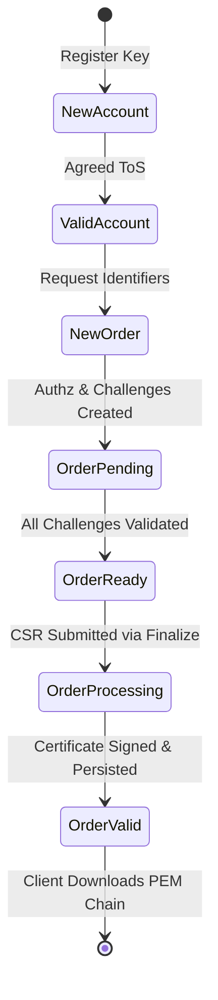

# RFC 8555 Automated Certificate Management Environment (ACME) Server

This document details the architectural design, security model, and protocol implementation of the RFC 8555 ACME automated issuance service in `go-certa`.

---

## 1. The RFC 8555 State Machine & Lifecycle

ACME standardizes the fully automated issuance, renewal, and revocation of X.509 certificates without human intervention. The issuance lifecycle is governed by a strict state machine:



### 1.1 Resource Relationships & Flow
1. **Directory (`GET /.well-known/acme/directory`)**: Serves endpoint URLs for all operations (`newNonce`, `newAccount`, `newOrder`, `revokeCert`).
2. **Replay-Nonce (`HEAD /acme/new-nonce`)**: Provides a cryptographically secure, single-use anti-replay token.
3. **Account (`POST /acme/new-account`)**: Creates or looks up an account keyed by the client's public key (using RFC 7638 JWK Thumbprints).
4. **Order (`POST /acme/new-order`)**: The client specifies domain identifiers (e.g. `test.example.com`). The server creates the order in status `pending` and issues an `Authorization` for each domain.
5. **Authorization & Challenge (`GET /acme/authz/{id}`, `POST /acme/challenge/{id}`)**: Each authorization contains challenge objects (`http-01`). The client proves ownership of the domain by hosting `keyAuthorization` at `http://{domain}/.well-known/acme-challenge/{token}` and triggers validation.
6. **Finalize (`POST /acme/order/{id}/finalize`)**: Once all authorizations transition to `valid`, the order transitions to `ready`. The client posts a CSR. The CA validates the CSR, signs the certificate, stores it, and transitions the order to `valid`.
7. **Certificate Retrieval (`GET /acme/cert/{id}`)**: Returns the full certificate chain (`application/pem-certificate-chain`).

---

## 2. JWS Message Signing & Anti-Replay Protection

### 2.1 JSON Web Signature (RFC 7515 & RFC 8555 §6.2)
All state-modifying requests in ACME are transmitted as JWS objects:
```json
{
  "protected": "<base64url-encoded-header>",
  "payload": "<base64url-encoded-payload>",
  "signature": "<base64url-encoded-signature>"
}
```

The protected header must include:
- `alg`: Cryptographic signature algorithm (`RS256` or `ES256`).
- `nonce`: A fresh, single-use anti-replay nonce obtained from the server.
- `url`: The exact URL the request is posted to (protects against request redirection).
- Key Identification:
  - `jwk`: Provided during account creation (`newAccount`) to bind the account key.
  - `kid`: Provided for all subsequent authenticated calls, referencing the Account URL (`/acme/acct/{id}`).

### 2.2 Replay-Nonce Lifecycle & Anti-Replay Defense
To defend against replay and man-in-the-middle attacks:
- The server generates 128-bit random nonces with a limited time-to-live (e.g., 15 minutes).
- When a JWS is processed, `ValidateAndConsumeNonce` checks and **immediately deletes** the nonce from memory.
- If a client replays an old request or tries to reuse a nonce, the server rejects it with `urn:ietf:params:acme:error:badNonce` (HTTP 400).
- **RFC 8555 §6.5 Mandate**: Every response to an HTTP POST request **MUST** include a fresh `Replay-Nonce` header to pipeline the next request smoothly.

### 2.3 POST-as-GET Requests (RFC 8555 §6.3)
To authenticate read-only operations without transmitting state changes:
- ACME clients query resources (`/acme/order/{id}`, `/acme/authz/{id}`, `/acme/cert/{id}`, `/acme/acct/{id}`) using a JWS with an **empty payload** (`payload: ""`).
- The server validates the signature and nonce, authenticates the account, and returns the resource representation with a fresh `Replay-Nonce`.

---

## 3. RFC 7638 JWK Thumbprint

The JWK Thumbprint computes a deterministic digest of a public key. It is used to generate the ACME `keyAuthorization`:
$$\text{keyAuthorization} = \text{token} \parallel \text{"."} \parallel \text{thumbprint}$$

The thumbprint requires canonical JSON representation containing only required fields sorted in alphabetical order:
- **RSA**: `{"e":"...","kty":"RSA","n":"..."}`
- **EC (P-256)**: `{"crv":"P-256","kty":"EC","x":"...","y":"..."}`

The SHA-256 hash of this canonical JSON string is Base64URL-encoded (without padding).

---

## 4. Header Specifications & Standard Client Compliance

Strict compliance with RFC 8555 headers is required for interoperability with standard ACME clients (Certbot, Lego, Caddy, Traefik):

### 4.1 Challenge Responses (RFC 8555 §7.5.1)
When responding to challenge triggers (`POST /acme/challenge/{id}`):
- `Link: <{baseURL}/acme/authz/{authzID}>;rel="up"`: **Mandatory**. Standard ACME clients (e.g., Certbot) parse this relation to discover the parent authorization and track challenge status.
- `Location: <{challengeURL}>`: Points to the challenge resource.
- `Content-Type: application/json`: Encodes the updated challenge object.

### 4.2 Order Finalization & State (RFC 8555 §7.4)
- `Location: <{baseURL}/acme/order/{orderID}>`: Communicates the authoritative order resource URL.

### 4.3 Certificate Retrieval (RFC 8555 §7.4.2)
- `Content-Type: application/pem-certificate-chain`: Contains the end-entity certificate followed by the issuing intermediate CA certificate.
- `Link: <{baseURL}/ca/intermediate.crt>;rel="up"`: Points to the issuer's certificate.

### 4.4 Account Error Recovery (RFC 8555 §6.7)
When a client presents an unknown or deactivated `kid`, the server returns:
- Problem Type: `urn:ietf:params:acme:error:accountDoesNotExist` (HTTP 400).
- This standard problem type instructs ACME clients to immediately recover by generating a new account key rather than failing permanently.

---

## 5. End-to-End Automation with Certbot

To test automated issuance using the reference Let's Encrypt Certbot client:

### 5.1 Start `go-certa` ACME Server
```powershell
go run ./cmd/certa-server --port 8080 --skip-challenge-validation --allow-internal-domains
```
- `--skip-challenge-validation`: Auto-accepts `http-01` challenges for local testing without public DNS/routing.
- `--allow-internal-domains`: Enables issuing certificates for internal/local hostnames (e.g., `test.local`).

### 5.2 Request Certificate via Certbot Standalone
```powershell
certbot certonly --standalone \
    --server http://localhost:8080/.well-known/acme/directory \
    -d test.local
```

### 5.3 Verify Trust Chain
```powershell
curl -s http://localhost:8080/ca/chain.pem -o ca-chain.pem
openssl verify -CAfile ca-chain.pem /etc/letsencrypt/live/test.local/fullchain.pem
```

---

## 6. Production Considerations

1. **Multi-Perspective Validation (MPV)**:
   - In production public CAs, validating HTTP-01 or DNS-01 challenges from a single vantage point leaves the CA vulnerable to localized BGP route hijacking or DNS poisoning.
   - Production deployments (such as Let's Encrypt) perform validation from multiple globally distributed vantage points, requiring quorum before marking an authorization `valid`.
2. **Rate Limiting**:
   - Rate limiting on `newAccount` (per IP), `newOrder` (per account/domain), and `newNonce` prevents resource exhaustion and protects downstream HSM signing infrastructure.
3. **CAA Record Checking**:
   - Prior to finalization, the CA checks DNS CAA (Certification Authority Authorization) records to ensure the domain explicitly authorizes the CA to issue certificates.
