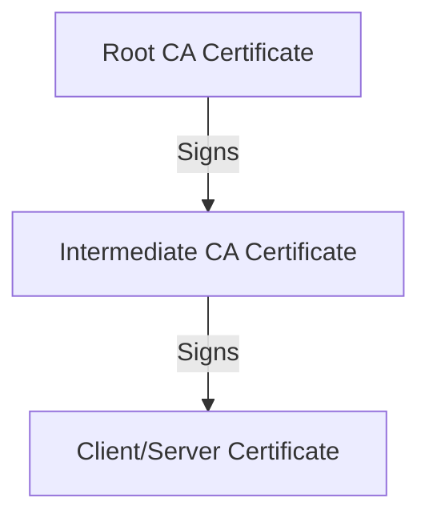

# Certificate Authority Engine

This module establishes the trust hierarchy and manages the issuance of end-entity certificates. It handles the generation of Root and Intermediate CA certificates and validates incoming requests.

## Key Concepts

A Certificate Authority establishes trust by signing public keys. We implement a standard two-tier CA hierarchy.

1. **Trust Anchor Hierarchy**: The Root CA acts as the ultimate trust anchor. It signs the Intermediate CA. The Intermediate CA is then used to sign client or server certificates. This isolation protects the Root CA from network exposure.
2. **Proof of Possession**: When a client requests a certificate, they submit a Certificate Signing Request (CSR). The CA verifies that the client holds the corresponding private key by checking the signature on the CSR.

## Implementation Structure

* `authority.go` initializes the Root and Intermediate CAs. It parses incoming CSRs, verifies the client's signature, and mints new certificates.

## Further Reading References

* [RFC 5280: Internet X.509 Public Key Infrastructure Certificate Profile](https://datatracker.ietf.org/doc/html/rfc5280)
* [X.509 Certificates Overview on Wikipedia](https://en.wikipedia.org/wiki/X.509)
* [Go x509 Package Documentation](https://pkg.go.dev/crypto/x509)
