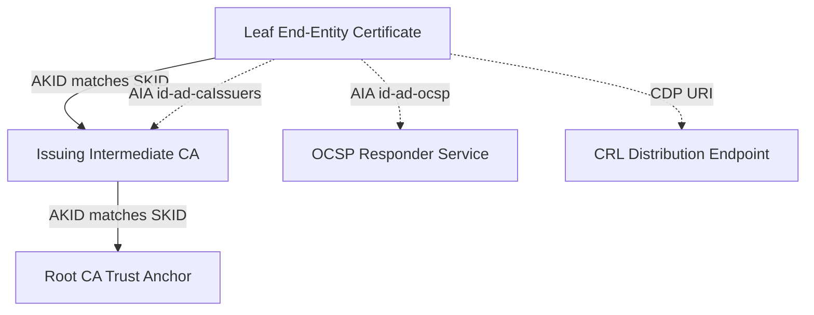

# Certificate Profiles, Extensions & AIA / CDP (RFC 5280 §4.2)

This document details the architectural design and security foundations of Certificate Profiles and Standard X.509 v3 Extensions in `go-certa`.

---

## 1. The Need for Certificate Profiles & Privilege Escalation Defense

In Public Key Infrastructure (PKI), issuing certificates without strict profiles and extension constraints introduces critical security vulnerabilities.

### 1.1 Preventing Privilege Escalation (Basic Constraints)
The `BasicConstraints` extension (RFC 5280 §4.2.1.9) defines whether the subject of a certificate is a Certificate Authority (`IsCA=true` or `IsCA=false`) and the maximum depth of valid certification paths that may follow (`MaxPathLen`).
- If an end-entity certificate mistakenly omits `BasicConstraints` or sets `IsCA=true`, the owner of that certificate's private key can act as a rogue intermediate CA.
- They can issue valid, trusted downstream certificates for *any* domain or user (e.g. `google.com`, `bank.com`), completely subverting the trust model.
- Historical vulnerabilities (such as early Windows CryptoAPI flaw CVE-2002-0862, discovered by Moxie Marlinspike) permitted any leaf certificate without `BasicConstraintsValid=true` to sign and chain other certificates.

`go-certa` enforces strict profiles where end-entity certificates explicitly assert:
```go
BasicConstraintsValid: true,
IsCA:                  false,
```
Subordinate CAs explicitly define:
```go
BasicConstraintsValid: true,
IsCA:                  true,
MaxPathLen:            0,
MaxPathLenZero:        true, // Disallows downstream intermediate creation
```

### 1.2 Cryptographic Scope: KeyUsage vs ExtendedKeyUsage
X.509 distinguishes between raw cryptographic capabilities and application semantics:
- **KeyUsage (Layer 1 - Cryptographic Primitive)**: Dictates how the public key may be used at the cryptographic layer:
  - `DigitalSignature`: Entity authentication, ephemeral TLS key exchanges (ECDHE/DHE), Proof-of-Possession.
  - `KeyEncipherment`: Encrypting symmetric session keys (e.g., RSA key transport).
  - `CertSign` & `CRLSign`: Authorizes the key exclusively to sign X.509 certificates and revocation lists.
- **ExtKeyUsage (Layer 2 - Application Context)**: Dictates the application protocols and operational roles allowed for the certificate:
  - `ServerAuth` (`id-kp-serverAuth` / `1.3.6.1.5.5.7.3.1`): TLS Web Server authentication.
  - `ClientAuth` (`id-kp-clientAuth` / `1.3.6.1.5.5.7.3.2`): TLS Web Client authentication (mTLS).
  - `CodeSigning` (`id-kp-codeSigning` / `1.3.6.1.5.5.7.3.3`): Executable and script signature verification.

Restricting EKUs prevents a compromised code-signing or client mTLS certificate from being replayed as a TLS server certificate, or vice versa.

---

## 2. Standard X.509 v3 Extensions Architecture



### 2.1 Subject Key Identifier (SKID) & Authority Key Identifier (AKID)
Per **RFC 5280 §4.2.1.1** and **§4.2.1.2**:
- **SKID (`SubjectKeyIdentifier`)**: Identifies the certificate's public key. RFC 5280 Method (1) specifies calculating the 160-bit SHA-1 hash of the raw `subjectPublicKey` bit string (excluding tag and length).
- **AKID (`AuthorityKeyIdentifier`)**: Identifies the public key used to sign the certificate. It matches the issuing CA's `SubjectKeyIdentifier`.
- **Chain Building Optimization**: Rather than searching and verifying issuer distinguished names (which can be ambiguous, duplicated, or renamed), TLS validators (OpenSSL, Go `crypto/x509`, NSS) match `AKID -> SKID` to resolve certificate paths deterministically.

### 2.2 Authority Information Access (AIA - RFC 5280 §4.2.2.1)
The AIA extension contains uniform resource identifiers that relying parties use to resolve trust and revocation dynamically:
- **`id-ad-caIssuers` (`1.3.6.1.5.5.7.48.2`)**: Direct HTTP URL to fetch the issuing intermediate CA certificate. When a TLS client encounters an incomplete certificate chain (missing intermediate), modern TLS stacks fetch the intermediate dynamically using this URL (AIA chasing).
- **`id-ad-ocsp` (`1.3.6.1.5.5.7.48.1`)**: The HTTP endpoint of the Online Certificate Status Protocol (OCSP) responder for real-time revocation verification.

### 2.3 CRL Distribution Points (CDP - RFC 5280 §4.2.1.13)
The CDP extension specifies HTTP URLs where relying parties can download complete signed Certificate Revocation Lists (CRLs) to perform offline revocation validation.

### 2.4 Subject Alternative Names (SAN) vs Common Name (CN)
Under modern TLS standards (RFC 6125 and CA/B Forum BR §7.1.4.2), the legacy `commonName` attribute in the Subject DN is deprecated for identity verification. Relying parties exclusively validate hostnames and IP addresses against the `subjectAltName` extension (`DNSNames`, `IPAddresses`).
`go-certa` enforces `RequireSAN=true` on TLS server profiles.

---

## 3. Profiles Implemented in `go-certa`

| Profile Name | KeyUsage | ExtKeyUsage | IsCA | Max Validity | Require SAN |
| :--- | :--- | :--- | :--- | :--- | :--- |
| **`server-tls`** | DigitalSignature, KeyEncipherment | ServerAuth, ClientAuth | false | 398 Days | Yes |
| **`client-auth`** | DigitalSignature | ClientAuth | false | 730 Days | No |
| **`code-signing`** | DigitalSignature | CodeSigning | false | 1095 Days | No |
| **`sub-ca`** | CertSign, CRLSign | None | true | 10 Years | No |

---

## 4. Issuance Workflow

```go
// 1. Resolve Profile
profile, err := ca.GetProfile(ca.ProfileServerTLS)

// 2. Configure AIA / CDP publication endpoints
extConfig := ca.ExtensionConfig{
    OCSPServerURLs:         []string{"http://ocsp.certa.local"},
    IssuingCertificateURLs: []string{"http://pki.certa.local/ca.crt"},
    CRLDistributionPoints:  []string{"http://pki.certa.local/crl.crl"},
}

// 3. Issue certificate enforcing profile constraints & extensions
certDER, err := authority.SignCertificateWithProfile(
    csrDER,
    serial,
    *profile,
    extConfig,
    30*24*time.Hour,
    []string{"api.internal.net"},
    nil,
)
```
