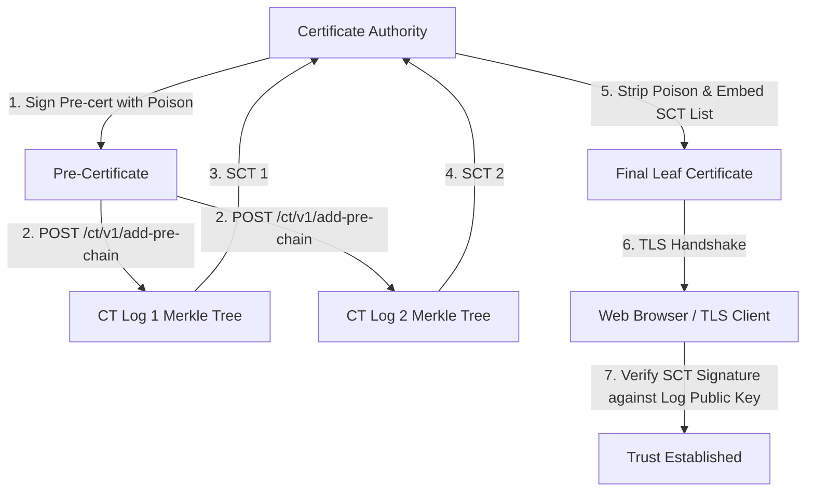
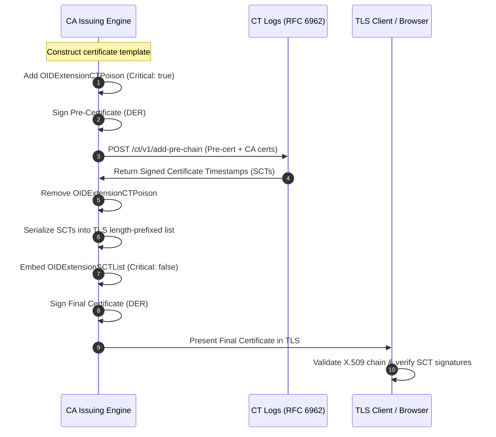

# RFC 6962 Certificate Transparency (CT) & Pre-Certificates

This document details the architectural design, security model, and implementation of Certificate Transparency (CT) and Pre-Certificate submission in `go-certa`.

---

## 1. Background & Purpose of Certificate Transparency

### 1.1 Why Certificate Transparency Was Created
Before Certificate Transparency, the Web PKI model suffered from structural vulnerabilities:
- Any trusted Certificate Authority (CA) in a browser or OS root store could issue a certificate for *any* domain name without the domain owner's knowledge or consent.
- High-profile compromises (e.g., **DigiNotar** in 2011, where fraudulent wildcard certificates for `*.google.com` were issued and used for state-level surveillance; **Comodo** in 2011; **Trustwave** rogue subordinates) demonstrated that silent misissuance was actively exploited in the wild.
- Revocation mechanisms (CRLs and OCSP) failed to detect misissuance until after rogue certificates were intercepted by third parties.

RFC 6962 introduced **Certificate Transparency**, creating public, append-only, cryptographically verifiable Merkle tree audit logs. This guarantees:
1. **Public Discoverability**: Domain owners and automated monitors can observe all issued certificates in real time.
2. **Accountability**: CAs cannot secretly issue rogue certificates without logging them.
3. **Browser Enforcement**: Modern browsers (Google Chrome, Apple Safari) require valid Signed Certificate Timestamps (SCTs) from independent public logs before trusting any publicly trusted TLS server certificate.

---

## 2. Merkle Audit Trees and SCT Verification

### 2.1 Cryptographic Audit Logs (RFC 6962 §2)
A CT log is an append-only Merkle hash tree using SHA-256. When an entry is appended:
- Leaf hash: $\text{MTH}(\{d_0\}) = \text{SHA-256}(0x00 \parallel d_0)$
- Internal node hash: $\text{MTH}(D) = \text{SHA-256}(0x01 \parallel \text{MTH}(D_1) \parallel \text{MTH}(D_2))$

The log issues a **Signed Certificate Timestamp (SCT)**, which is a cryptographically signed promise that the entry will be incorporated into the log's Merkle tree within a Maximum Merge Delay (MMD, typically 24 hours).

### 2.2 SCT Structure (RFC 6962 §3.2)
An SCT contains:
- `sct_version`: `v1(0)`
- `id`: 32-byte SHA-256 hash of the CT log's public key
- `timestamp`: 64-bit UTC milliseconds since Unix epoch
- `extensions`: opaque extension bytes (usually empty, 2-byte length prefix 0)
- `signature`: Digitally signed tree hash over:
  $$\text{version} \parallel \text{signature\_type(certificate\_timestamp)} \parallel \text{timestamp} \parallel \text{entry\_type(precert\_entry)} \parallel \text{signed\_entry}$$

---

## 3. Pre-Certificates & The Critical Poison Extension

A circular dependency exists if a certificate must contain proof of its own logging:
1. To embed the SCT into the certificate, the SCT must be obtained before final issuance.
2. But the CT log must log the certificate to issue an SCT.
3. If the log logs a certificate, that certificate cannot later be modified (e.g. to add the SCT) without invalidating its signature!

RFC 6962 resolves this circularity using **Pre-Certificates**:

### 3.1 The CT Poison Extension (`1.3.6.1.4.1.11129.2.4.3`)
A pre-certificate is identical to the final certificate with two exceptions:
1. It contains a critical extension with OID `1.3.6.1.4.1.11129.2.4.3` (`OIDExtensionCTPoison`), with an ASN.1 `NULL` (`05 00`) value.
2. It does *not* contain the SCT list extension.

Because standard TLS clients and browsers reject certificates with unrecognized critical extensions, **a pre-certificate can never be used in a TLS handshake**. It is strictly a logging artifact.

### 3.2 SCT List Encoding (`1.3.6.1.4.1.11129.2.4.2`)
Once the CA receives SCTs from one or more CT logs:
1. Each SCT is serialized into RFC 6962 §3.2 binary format.
2. Each SCT is prefixed by a 2-byte big-endian length (`uint16`).
3. All length-prefixed SCTs are concatenated.
4. The entire block is prefixed by a 2-byte total length (`uint16`).
5. This serialized TLS list is wrapped in an ASN.1 `OCTET STRING` and placed in the X.509 extension `OIDExtensionSCTList` (`1.3.6.1.4.1.11129.2.4.2`, non-critical).

---

## 4. Implementation in `go-certa`

The CT architecture in `go-certa` is organized across `pkg/ctlog` and `pkg/ca`:

### 4.1 Data Models (`pkg/ctlog/models.go`)
- `SignedCertificateTimestamp`: Represents the parsed SCT, implementing `MarshalBinary()` to produce canonical RFC 6962 §3.2 binary representation.
- `AddChainRequest`: JSON payload containing base64-encoded certificate chains sent to `/ct/v1/add-pre-chain` or `/ct/v1/add-chain`.
- `AddChainResponse`: JSON response containing the log ID, timestamp, extensions, and signature.

### 4.2 Pre-Certificate Lifecycle (`pkg/ctlog/precert.go`)
- `BuildPreCertificateTemplate(template)`: Clones the X.509 certificate template and appends the critical `OIDExtensionCTPoison`.
- `SerializeSCTList(scts)`: Encodes multiple SCT binary blobs with dual 2-byte TLS length prefixes and wraps them in ASN.1 `OCTET STRING`.
- `EmbedSCTList(template, sctListBytes)`: Strips `OIDExtensionCTPoison` from the template and attaches `OIDExtensionSCTList`.

### 4.3 CT Log Client Submitter (`pkg/ctlog/client.go`)
- `CTSubmitter`: Configured with log URLs and optional HTTP client timeouts.
- `SubmitPreCertificate(ctx, precertDER, issuerDER)`: Submits pre-certificate and issuer DER to `/ct/v1/add-pre-chain`, decodes JSON response, unpacks the base64 ECDSA signature, and returns raw binary SCTs.

### 4.4 In-Memory Mock CT Log (`pkg/ctlog/mock_log.go`)
- `MockCTLog`: For integration testing and local development.
- Spawns an `httptest.Server` implementing `/ct/v1/add-pre-chain`.
- Generates a P-256 ECDSA key pair, computes the 32-byte LogID, digitally signs the RFC 6962 `PrecertChainEntry` tree hash, and returns an RFC-compliant `AddChainResponse`.

### 4.5 Two-Phase Issuance Engine (`pkg/ca/authority.go`)
- `SignCertificateWithCT(ctx, template, submitter)`:
  1. Clones template and adds critical CT poison extension.
  2. Signs the pre-certificate DER with the CA private key.
  3. Submits pre-certificate to the configured CT logs via `CTSubmitter`.
  4. Serializes returned SCTs into the RFC 6962 SCT list.
  5. Removes the poison extension, embeds the SCT list extension, and signs the final leaf certificate.
  6. Stores and registers the certificate in persistent storage.

---

## 5. Security Guarantees & Verification

1. **Poison Invalidation**: Any attempt to present a pre-certificate to a compliant TLS client will be rejected immediately due to the unhandled critical extension `1.3.6.1.4.1.11129.2.4.3`.
2. **Non-Tamperability**: Modifying the SCT list or leaf certificate invalidates the CA's signature on the leaf certificate. Modifying the leaf certificate invalidates the CT log's signature on the SCT.
3. **Log Quorum**: Production issuance typically submits pre-certificates to at least 2 or 3 independent CT logs operated by distinct entities (e.g. Google, Cloudflare, Let's Encrypt, DigiCert) to satisfy browser CT qualification requirements.
