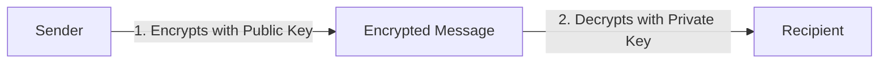
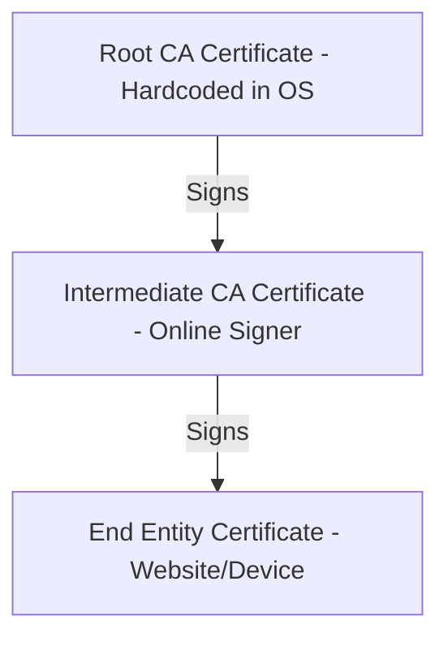

# PKI and Certificate Authority Core Concepts

This guide explains the foundational concepts of Public Key Infrastructure (PKI) and Certificate Authorities. It uses simple analogies and real world examples to help you understand the core mechanics without needing to read the original RFC specifications.

---

## 1. Asymmetric Cryptography (The Foundations)

In traditional security, you use a single password to lock and unlock a safe. If someone intercepts that password, they gain full access. Asymmetric cryptography solves this by using a pair of mathematically linked keys instead of a single secret.

* **The Public Key**: This key is public. Anyone can see it. It is used to encrypt data or verify a signature.
* **The Private Key**: This key is kept secret. Only the owner possesses it. It is used to decrypt data or create a signature.

### Analogy: The Mailbox
Think of the public key as a mailbox address. Anyone can drop a letter through the slot (encrypting a message using your public key). However, only the person with the physical mailbox key (your private key) can open the mailbox and read the letters (decrypting the message).

---

## 2. Why Do We Need a Certificate Authority?

If you have a public key, how does a third party know it actually belongs to you? 

### The Problem: Man in the Middle
If you connect to a server that claims to be `bank.com`, the server sends you its public key. But what if an attacker intercepted your connection and sent you their own public key instead? Without a trusted validator, you cannot verify if the public key belongs to the real bank or the attacker.

### The Solution: The Certificate Authority (CA)
A Certificate Authority acts like a government issuing passports. The CA verifies your identity and then signs a document containing your name and your public key. This signed document is a **Digital Certificate** (specifically an X.509 certificate). 

When a client connects to `bank.com`, the bank sends its digital certificate. The client verifies the CA's signature on the certificate. Since the client trusts the CA, it now trusts that the public key belongs to the bank.

---

## 3. The Trust Chain (Hierarchy)

A Certificate Authority does not sign all certificates using a single master key. Instead, they use a hierarchy of certificates to manage trust and risk.

### The Root CA
The Root CA is the ultimate trust anchor. Its certificate is self-signed (signed by its own private key). Operating systems and browsers come pre-installed with a list of trusted Root CA certificates (known as the Trust Store). 

Because the Root CA is highly sensitive, its private key is kept offline. It is stored on physical hardware in an air-gapped vault.

### The Intermediate CA
To issue certificates online in real time, the Root CA signs an Intermediate CA certificate. The Intermediate CA's private key is kept online, usually inside a Hardware Security Module (HSM). The Intermediate CA is responsible for signing the final customer certificates.

If an Intermediate CA key is compromised, only that Intermediate needs to be revoked. The Root CA remains secure and can issue a new Intermediate CA.

### End Entity
These are the final certificates issued to websites, devices, or users. They cannot be used to sign other certificates.

---

## 4. Certificate Signing Request (CSR) and Proof of Possession

When a client wants to obtain a certificate from a CA, they do not send their private key. They generate a **Certificate Signing Request (CSR)**.

A CSR contains:
1. Your identity details (domain name, organization).
2. Your public key.
3. A digital signature created with your private key.

### Proof of Possession (PoP)
Before the CA signs the certificate, it must verify that you actually own the private key associated with the public key inside the CSR. The CA does this by validating the signature on the CSR. If the signature is valid, you have proven possession of the private key.

---

## 5. Automated Enrollment Protocols (EST and ACME)

Manually generating private keys, creating CSRs, and submitting them to a CA website is slow and error-prone. Modern PKI uses automation protocols.

### ACME (RFC 8555)
Used primarily for web servers (e.g., Let's Encrypt). The ACME protocol automatically validates that you control a domain by asking your server to complete a challenge. 
* **HTTP-01 Challenge**: The CA asks your server to host a specific file at a specific URL. The CA then attempts to download that file. If successful, it proves you control the domain, and the CA automatically issues the certificate.

### EST (RFC 7030)
Used primarily for network routers and IoT devices. EST runs over secure TLS connections and offers simple endpoints:
* `/cacerts`: Returns the CA's certificate chain so the device knows who to trust.
* `/simpleenroll`: Accepts a base64-encoded CSR and returns the signed certificate immediately.

---

## 6. Revocation (CRL and OCSP)

Sometimes a certificate must be invalidated before its expiration date (e.g., if a device is stolen or a private key is leaked). The CA must inform clients that the certificate is no longer trusted.

### CRL (Certificate Revocation List)
A CRL is a list of revoked certificate serial numbers signed by the CA. Clients download the entire list periodically. 
* **The Downside**: As more certificates are revoked, the list grows larger, consuming significant bandwidth and memory on client devices.

### OCSP (Online Certificate Status Protocol)
Instead of downloading the entire list, the client queries the CA's OCSP responder directly. The client sends the serial number of the certificate, and the responder returns a signed status message indicating whether that specific certificate is `Good`, `Revoked`, or `Unknown`.

---

## Further Reading References

* [RFC 5280: Internet X.509 PKI Certificate Profile](https://datatracker.ietf.org/doc/html/rfc5280)
* [RFC 7030: Enrollment over Secure Transport (EST)](https://datatracker.ietf.org/doc/html/rfc7030)
* [RFC 6960: Online Certificate Status Protocol (OCSP)](https://datatracker.ietf.org/doc/html/rfc6960)
