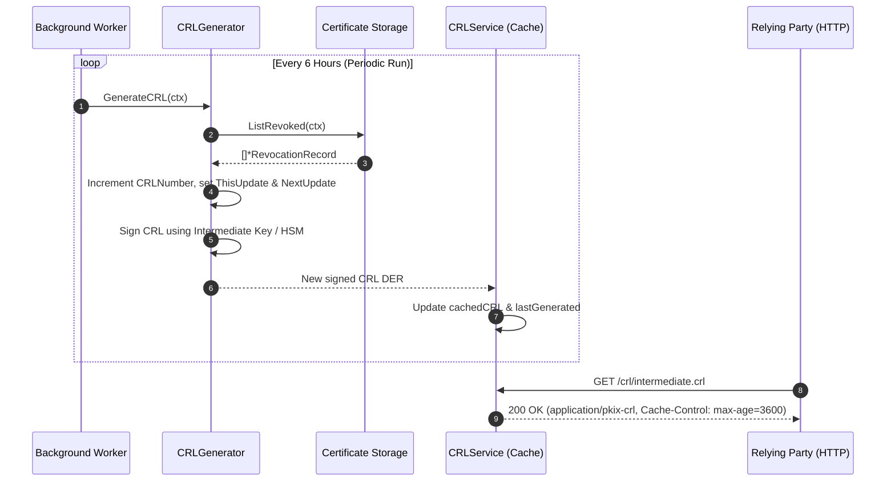

# Certificate Revocation List (CRL) Generation & Publishing Service (RFC 5280 §5)

This document details the architecture, operational semantics, and security mechanics of the RFC 5280 Certificate Revocation List (CRL) generation and HTTP publishing engine in `go-certa`.

---

## 1. Mechanics of RFC 5280 CRLs

A Certificate Revocation List (CRL) is an ASN.1 DER-encoded, digitally signed data structure issued by a CA listing certificates that have been revoked prior to their scheduled expiration date.

### 1.1 Structural Anatomy (X.509 v2 CRL Profile)
An RFC 5280 CRL consists of:
- **`tbsCertList` (To-Be-Signed Certificate List)**:
  - **`version`**: `v2` (integer `1`), required when X.509 extensions are present.
  - **`signature`**: AlgorithmIdentifier matching the signing key (e.g., `SHA256WithRSA`).
  - **`issuer`**: Distinguished Name of the issuing CA.
  - **`thisUpdate`**: UTC / GeneralizedTime indicating the issuance timestamp.
  - **`nextUpdate`**: UTC / GeneralizedTime defining the deadline by which the next CRL will be issued. Relying parties consider a CRL expired if the current clock is past `nextUpdate`.
  - **`revokedCertificates`**: Sequence of zero or more revoked certificate records containing:
    - `userCertificate`: Positive integer serial number of the revoked certificate.
    - `revocationDate`: Timestamp when the revocation became effective.
    - `crlEntryExtensions`: Optional attributes, primarily `CRLReason` (RFC 5280 §5.3.1) indicating why the certificate was invalidated (e.g., `keyCompromise`, `superseded`, `cessationOfOperation`).
  - **`crlExtensions`**:
    - `cRLNumber` (RFC 5280 §5.2.3): Monotonically increasing sequence number ensuring freshness tracking.
    - `authorityKeyIdentifier` (RFC 5280 §5.2.1): Identifies the intermediate CA key that signed the CRL.
- **`signatureAlgorithm`**: OID identifying the signature algorithm.
- **`signatureValue`**: Cryptographic digital signature generated by the CA private key / HSM.

---

## 2. Base CRLs vs Delta CRLs

| Attribute | Base CRL | Delta CRL |
| :--- | :--- | :--- |
| **Scope** | Contains **all** active revocations for the CA's entire history. | Contains **only changes** (new revocations) since a specific Base CRL. |
| **Extension** | Contains `cRLNumber`. | Contains `deltaCRLIndicator` pointing to the base CRL number. |
| **Size & Bandwidth** | Grows monotonically with total revocations over time. | Small, lightweight update payloads. |
| **Client Complexity**| Simple: single download and verify against CA certificate. | Complex: client must fetch and merge both Base and Delta CRLs. |

`go-certa` implements the robust **Base CRL** architecture as the authoritative source of truth, serving full snapshot lists optimized for high-performance HTTP caching and edge CDN distribution.

---

## 3. Scheduled Automated Regeneration & Expiration Prevention

### 3.1 The Danger of Stale CRLs & Hard-Fail Outages
When relying parties (browsers, TLS client libraries, VPN clients) evaluate certificate status:
- If a client has strict CRL validation enabled ("hard-fail" mode) and the current time exceeds `nextUpdate`, the client **must reject the TLS connection**, causing widespread service outages.
- Even in "soft-fail" mode, stale CRLs create security windows where revoked keys remain trusted.

### 3.2 Automated Background Worker Strategy
To eliminate the risk of expiration:
1. **Periodic Background Ticker**: `CRLService` runs an automated background scheduler that regenerates the signed CRL well before `nextUpdate` arrives (e.g., every 6 hours for a 24-hour validity window, providing a $4\times$ redundancy buffer).
2. **Monotonic Sequence Management**: Each regeneration atomically increments `CRLNumber`, allowing relying parties to detect and reject replayed older lists.
3. **In-Memory Caching**: The signed DER bytes are retained in memory behind a `sync.RWMutex`, allowing HTTP handlers to serve requests with microsecond latency without repeatedly hitting the HSM or database.



---

## 4. CRL Distribution Points (CDP) & Edge Caching Architecture

### 4.1 Embedding CDP in Issued Certificates
The CRL endpoint URL is embedded directly into every leaf certificate via the CDP extension (`CRLDistributionPoints`):
```go
CRLDistributionPoints: []string{"http://crl.certa.local/crl/intermediate.crl"}
```

### 4.2 HTTP Caching Semantics
The `crl.Handler` provides RFC 2585 and RFC 5280 compliant HTTP delivery:
- **`Content-Type: application/pkix-crl`**: Canonical MIME type for raw binary DER-encoded CRLs.
- **`Cache-Control: public, max-age=3600, must-revalidate`**: Instructs reverse proxies and CDNs (Cloudflare, Fastly, AWS CloudFront) to cache the CRL at edge locations worldwide, offloading traffic from the core CA cluster.
- **`Last-Modified` & `HEAD` support**: Enables caching proxies and monitoring agents to poll for updates without transferring the entire binary payload.
