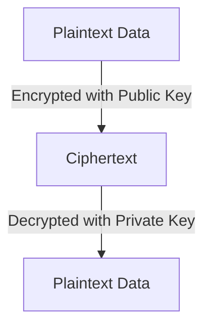
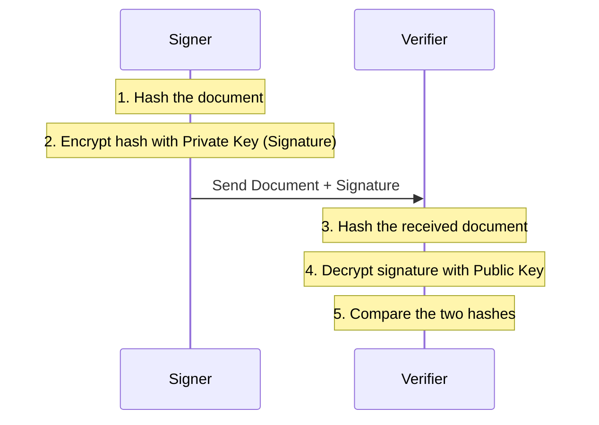

# Cryptography Foundations for PKI

Public Key Infrastructure (PKI) relies on asymmetric cryptography. This document explains the underlying mathematical concepts, algorithms, and practical applications used in digital certificate systems.

---

## 1. Asymmetric vs. Symmetric Cryptography

In symmetric cryptography, the same key is used to encrypt and decrypt data. While fast, it requires securely sharing the key beforehand. 

Asymmetric cryptography uses two different but mathematically related keys.

### Key Characteristics
* **Public Key**: Shared freely. Anyone can use it to encrypt a message meant for you or to verify a signature you created.
* **Private Key**: Kept strictly secret. Only you can use it to decrypt messages encrypted with your public key or to create digital signatures.

---

## 2. Core Cryptographic Algorithms in PKI

Enterprise CAs primarily use two families of asymmetric algorithms: RSA and Elliptic Curve Cryptography (ECC).

### RSA (Rivest-Shamir-Adleman)
RSA is based on the mathematical difficulty of factoring the product of two large prime numbers.

* **Key Sizes**: Typically 2048, 3072, or 4096 bits. Key sizes below 2048 bits are no longer considered secure for modern applications.
* **Performance**: Encryption and signature verification are extremely fast. However, decryption and signature generation are computationally heavy and slow.
* **Characteristics**: RSA keys are large, resulting in larger certificate files and increased network overhead during TLS handshakes.

### ECC (Elliptic Curve Cryptography)
ECC is based on the algebraic structure of elliptic curves over finite fields. The security relies on the difficulty of the Elliptic Curve Discrete Logarithm Problem.

* **Key Sizes**: Typically 256, 384, or 521 bits.
* **Performance**: Offers faster key generation and signature creation than RSA. It also uses less power and memory, making it ideal for mobile and IoT devices.
* **Security Strength**: A 256-bit ECC key provides equivalent security to a 3072-bit RSA key, resulting in much smaller certificate payloads.
* **Common Curves**: NIST P-256 (secp256r1), NIST P-384, and Ed25519.

---

## 3. How Digital Signatures Work

Digital signatures provide three security guarantees:
1. **Authenticity**: Proves who signed the document.
2. **Integrity**: Proves the document was not altered after signing.
3. **Non-repudiation**: The signer cannot deny signing the document.

### The Signing and Verification Process

Signing does not encrypt the entire document. Instead, it signs a short representation of the document called a hash.

1. **Hashing**: The signer runs the document through a cryptographic hash function (such as SHA-256) to produce a fixed-size digest. Any change to the document completely changes this digest.
2. **Encryption**: The signer encrypts the digest using their private key. This encrypted digest is the digital signature.
3. **Verification**: The recipient hashes the received document. They also decrypt the digital signature using the signer's public key. If the two digests match, the signature is valid.

---

## 4. Padding Schemes

Asymmetric encryption algorithms require padding schemes to format data before it is processed. This ensures the output is random and protects against mathematical attacks.

### RSA Padding Types
* **PKCS#1 v1.5**: An older, simpler padding standard. While widely supported, it is vulnerable to certain padding oracle attacks if implemented incorrectly.
* **PSS (Probabilistic Signature Scheme)**: A modern, highly secure padding scheme for signatures. It is recommended for all new deployments.
* **OAEP (Optimal Asymmetric Encryption Padding)**: The recommended padding scheme for encrypting data using RSA.

---

## Further Reading References

* [RFC 8017: PKCS #1: RSA Cryptography Specifications Version 2.2](https://datatracker.ietf.org/doc/html/rfc8017)
* [NIST Cryptographic Standards and Guidelines](https://www.nist.gov/programs-projects/cryptographic-standards-and-guidelines)
* [Introduction to Elliptic Curve Cryptography on Cloudflare](https://blog.cloudflare.com/a-relatively-easy-to-understand-guide-to-elliptic-curve-cryptography/)
