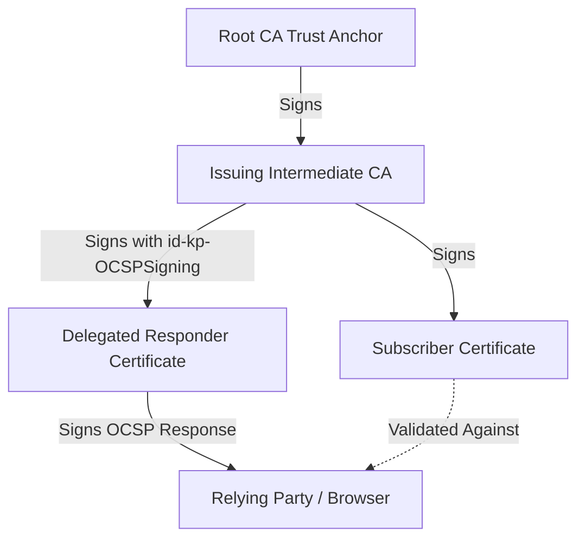
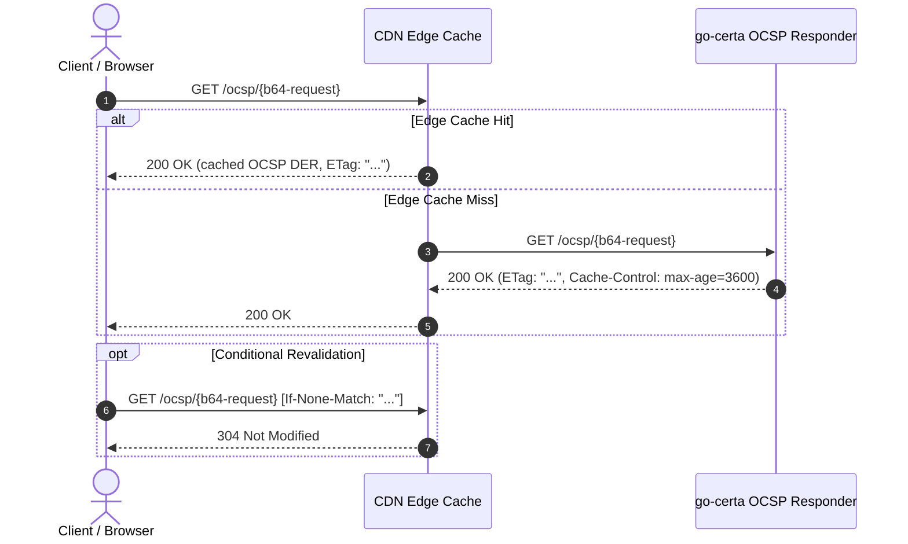

# High-Performance Delegated OCSP Responder (RFC 6960 & RFC 5019)

This document details the architectural design, security benefits, and HTTP caching optimizations implemented in the `go-certa` Online Certificate Status Protocol (OCSP) service.

---

## 1. Why CAs Use Delegated OCSP Responders

In a standard PKI hierarchy, an OCSP response must be signed by an entity trusted to assert the certificate's status. RFC 6960 defines two signing models:
1. **Direct CA Signing**: The Intermediate CA signs each OCSP response directly using its primary signing key.
2. **Delegated OCSP Responder (Authorized Responder)**: The Intermediate CA issues a specialized certificate to a dedicated OCSP responder service, containing the Extended Key Usage `id-kp-OCSPSigning` (`1.3.6.1.5.5.7.3.9` / `x509.ExtKeyUsageOCSPSigning`).

### 1.1 Key Isolation & Threat Modeling
Direct CA signing requires keeping the CA's private key in an online, network-facing system. In high-security PKI designs:
- **CA Private Key Protection**: An issuing CA key is stored in an isolated Hardware Security Module (HSM) with strict rate limits and network segmentation. Exposing the CA key to online public queries creates unacceptable risk of key compromise or side-channel extraction.
- **Delegated Key Lifecycle**: A delegated responder key is disposable. It has a short validity duration (e.g., 7–30 days) and can be revoked or rotated instantly without replacing or re-issuing the intermediate CA certificate or modifying trust stores.
- **HSM Resource Preservation**: Modern internet services handle millions of TLS handshakes per second. Offloading cryptographic signing from the CA HSM to dedicated, horizontally scalable OCSP signer nodes prevents CA signing bottlenecking.



---

## 2. Status Semantics (RFC 6960 §2.2)

When an OCSP request is evaluated, `go-certa` returns one of three authoritative statuses:

| Status | Meaning & Validation Condition |
| :--- | :--- |
| **`Good` (`0`)** | The certificate was issued by the CA, is actively tracked in storage, and has **not** been revoked. Note: per RFC 6960, "good" does not mean the certificate was ever issued unless pre-issuance tracking is active. |
| **`Revoked` (`1`)** | The certificate has been revoked prior to expiration. The response includes `RevokedAt` (UTC timestamp) and an RFC 5280 `RevocationReason` code (e.g. `keyCompromise`, `superseded`). |
| **`Unknown` (`2`)** | The CA has no record of ever having issued a certificate with the requested serial number. Returning `Unknown` (rather than `Good`) prevents attackers from querying non-existent certificates to probe CA behavior. |

---

## 3. High-Performance HTTP GET Caching (RFC 5019)

### 3.1 Overcoming the Limitations of HTTP POST
RFC 2560 initially specified OCSP as binary HTTP `POST`. However:
- HTTP `POST` requests are **uncacheable** by standard HTTP reverse proxies, CDNs, and browser caches.
- Every TLS handshake triggers an uncacheable HTTP POST back to the origin CA, causing immense infrastructure load and TLS connection latency.

### 3.2 RFC 5019 URI Construction
RFC 5019 specifies encoding the binary OCSP request into an HTTP GET path:
```
GET /ocsp/{url-encoded-base64-OCSPRequest}
```
Example:
```
GET /ocsp/MFMwU... HTTP/1.1
Host: ocsp.certa.local
```

### 3.3 CDN & Proxy Edge Offloading
`go-certa` implements standard HTTP caching headers on all OCSP responses:
- **`Content-Type: application/ocsp-response`**: Standard MIME type (RFC 6960 §A.1).
- **`Cache-Control: public, max-age=3600, no-transform, must-revalidate`**: Instructs CDNs (Cloudflare, Akamai, CloudFront) to cache responses at edge points-of-presence (PoPs) for 1 hour.
- **`ETag`**: Hexadecimal SHA-256 digest of the DER-encoded response payload.
- **Conditional GET (`If-None-Match`)**: When clients revalidate an unexpired cached response, the server returns **`304 Not Modified`** without re-transmitting the response body, saving 99%+ of origin bandwidth.



---

## 4. Revocation Management API

In addition to public OCSP responder endpoints, `go-certa` exposes a RESTful Revocation API for administrative control:

### Endpoint: `POST /api/v1/revoke`
- **Request Body**:
  ```json
  {
    "serial": "0100a1",
    "reason": 1
  }
  ```
- **Responses**:
  - `200 OK`: Certificate successfully marked revoked.
    ```json
    {
      "status": "revoked",
      "serial": "0100a1",
      "reason": 1,
      "revoked_at": "2026-09-05T16:15:00Z"
    }
    ```
  - `400 Bad Request`: Missing serial or invalid JSON.
  - `404 Not Found`: Certificate serial not found in storage.
  - `409 Conflict`: Certificate was already revoked.
