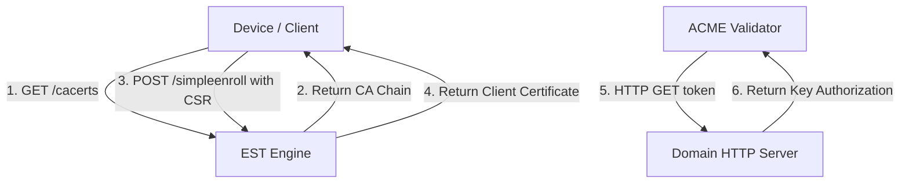

# Enrollment Protocols (EST and ACME)

This module implements mechanisms for clients to enroll and receive certificates automatically. We provide implementations of Enrollment over Secure Transport (EST) and ACME HTTP-01 challenge validation.

## Key Concepts

Automating certificate issuance reduces manual errors and ensures certificates are renewed before they expire.

1. **Enrollment over Secure Transport (EST)**: Defined in RFC 7030, EST is a simple enrollment protocol using HTTP endpoints. Devices query `/cacerts` to retrieve the current CA certificate chain and submit a PKCS#10 CSR to `/simpleenroll` to receive their certificate.
2. **ACME HTTP-01 Challenge**: Defined in RFC 8555, the ACME protocol automates domain validation. The HTTP-01 challenge verifies that a client controls a domain by checking if a specific token is served at a known URL on port 80.

## Implementation Structure

* `est/handler.go` implements the EST handler for serving CA certificates and processing simple enrollment requests.
* `acme/challenge.go` implements validation for HTTP-01 challenges.

## Further Reading References

* [RFC 7030: Enrollment over Secure Transport](https://datatracker.ietf.org/doc/html/rfc7030)
* [RFC 8555: Automatic Certificate Management Environment (ACME)](https://datatracker.ietf.org/doc/html/rfc8555)
* [Enrollment over Secure Transport Overview on Wikipedia](https://en.wikipedia.org/wiki/Enrollment_over_Secure_Transport)
