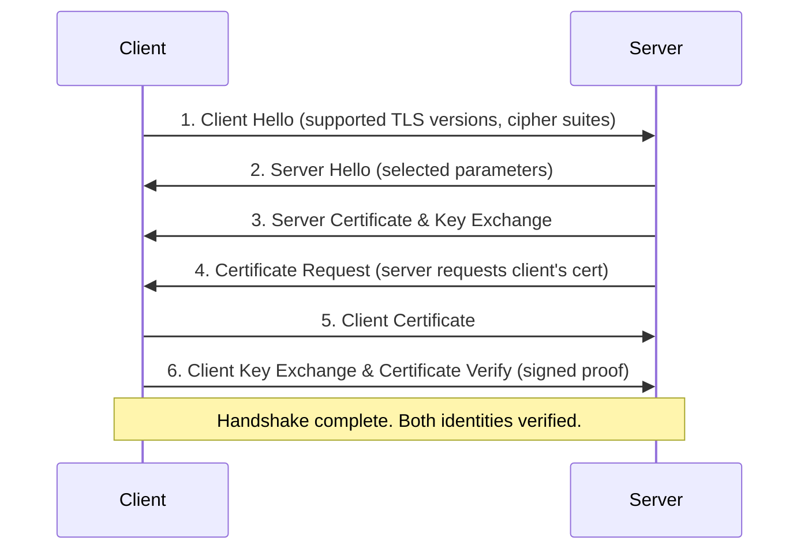

# Mutual TLS (mTLS)

Mutual TLS (mTLS) is a process where both the client and the server verify each other's cryptographic certificates before establishing a secure network connection.

---

## 1. How mTLS Differs from Standard TLS

In standard TLS, only the server proves its identity. The client verifies the server's certificate (e.g., when your web browser validates a bank's website). The server does not authenticate the client's identity at the cryptographic layer; it relies on application-level credentials like usernames and passwords.

In mTLS, both parties must present and verify certificates. The server will reject the connection immediately during the TLS handshake if the client fails to provide a certificate signed by a trusted authority.



---

## 2. The Verification Mechanics

For mTLS to succeed, three cryptographic validations happen during the handshake:

1. **Server Validation**: The client verifies the server's certificate against its local trust store.
2. **Client Validation**: The server verifies the client's certificate against its configured Certificate Authority trust pool.
3. **Proof of Private Key Possession**: The client signs a piece of handshake data using its private key and sends it to the server (the `Certificate Verify` message). The server uses the public key from the client's certificate to verify the signature. This proves the client holds the corresponding private key.

---

## 3. Running the Demo

We have provided a self-contained Go demonstration in the `examples/mtls` directory. The program performs the following steps:
1. Generates a mock Root CA.
2. Mints a server certificate and a client certificate signed by that Root CA.
3. Configures an HTTP server requiring client certificates (`tls.RequireAndVerifyClientCert`).
4. Launches the server on a local port.
5. Performs an HTTP GET request using a TLS client configured with the client certificate.

To run the demonstration:
```bash
go run ./examples/mtls
```

Expected output:
```text
Server Response: Hello test-client, mutual authentication successful!
```

---

## Further Reading References

* [RFC 8446: The Transport Layer Security (TLS) Protocol Version 1.3](https://datatracker.ietf.org/doc/html/rfc8446)
* [What is Mutual TLS (mTLS)? on Cloudflare](https://www.cloudflare.com/learning/access-management/what-is-mutual-tls/)
* [Go tls.Config Documentation](https://pkg.go.dev/crypto/tls#Config)
