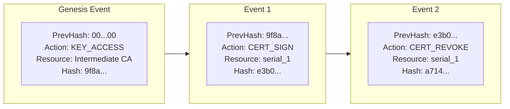

# Observability, Prometheus Telemetry & Tamper-Evident Audit Logging

This document outlines the observability architecture, cryptographic audit trail, and operational monitoring facilities in `go-certa`.

---

## 1. Regulatory Compliance (WebTrust, ETSI & SOC 2)

Operating a Certificate Authority demands strict compliance with global trust standards:
- **CA/Browser Forum Baseline Requirements §5.4**: Requires logging of all certificate issuance requests, approvals, revocations, key generation ceremonies, system startups/shutdowns, and profile configuration modifications.
- **WebTrust Principles and Criteria for Certification Authorities §3.4**: Mandates that audit logs be append-only, chronologically ordered, and protected from modification, deletion, or undetected truncation.
- **ETSI EN 319 411-1 / SOC 2 Type II**: Dictates audit retention, continuous monitoring, and tamper detection for privileged cryptographic operations.

To satisfy these mandates, `go-certa` implements:
1. **Cryptographic Append-Only Audit Logging (`pkg/audit`)**: Every state-changing PKI action is bound into a verifiable SHA-256 hash chain.
2. **Real-Time Prometheus Telemetry (`pkg/telemetry`)**: Zero-dependency metric collection and exposition (`GET /metrics`) providing visibility into CA health and performance.

---

## 2. Tamper-Evident Cryptographic Hash Chains

### 2.1 The Audit Log Hash Chain Architecture
Traditional system logs (e.g. syslog, log files) are susceptible to retroactive tampering: an adversary or rogue administrator who gains elevated access can alter or delete log entries without detection.

`go-certa` uses a **cryptographic hash chain** where every event includes the SHA-256 digest of the immediately preceding event:



### 2.2 Canonical Digest Computation
Each `AuditEvent` is serialized into a deterministic canonical representation:
$$\text{Payload} = \text{EventID} \parallel \text{"|"} \parallel \text{Timestamp (RFC3339Nano)} \parallel \text{"|"} \parallel \text{Action} \parallel \text{"|"} \parallel \text{Actor} \parallel \text{"|"} \parallel \text{Resource} \parallel \text{"|"} \parallel \text{Status} \parallel \text{"|"} \parallel \text{CanonicalMetadata} \parallel \text{"|"} \parallel \text{PrevHash}$$
$$\text{Hash} = \text{SHA-256}(\text{Payload})$$

- Metadata keys are lexicographically sorted to prevent non-deterministic map serialization.
- The genesis event anchors to `0000000000000000000000000000000000000000000000000000000000000000`.

### 2.3 Verification & Tamper Detection (`VerifyChain`)
`VerifyChain()` validates the integrity of the entire log sequence from genesis to head:
1. **Linkage Check**: Confirms each event's `PrevHash` matches the previous event's `Hash`.
2. **Digest Check**: Recomputes `ComputeEventHash(event)` from raw fields and compares with `event.Hash`.
3. If an attacker:
   - Modifies an event's fields: Recomputed hash diverges from `event.Hash`.
   - Modifies an event's hash: The subsequent event's `PrevHash` fails verification.
   - Deletes or inserts an event: The entire downstream chain linkage is permanently broken.

---

## 3. Operational Telemetry & Prometheus Metrics

`go-certa` embeds an in-process, zero-dependency Prometheus registry exporting standard metrics over `GET /metrics`.

### 3.1 Standard Metrics Catalog

| Metric Name | Type | Labels | Description |
|---|---|---|---|
| `certa_certificates_issued_total` | Counter | `profile` | Cumulative certificates minted (e.g. `server-tls`, `client-auth`, `code-signing`) |
| `certa_certificates_revoked_total` | Counter | `reason` | Cumulative certificate revocations grouped by RFC 5280 reason codes |
| `certa_ocsp_requests_total` | Counter | `status` | OCSP responder query throughput grouped by response status (`good`, `revoked`, `unknown`) |
| `certa_policy_rejections_total` | Counter | `reason` | Issuance requests rejected by CABF/RFC 5280 policy validation |
| `certa_signing_queue_depth` | Gauge | — | Current depth of queued signing requests waiting for HSM worker availability |
| `certa_revoked_certificates_count` | Gauge | — | Total number of currently active revoked certificates |

### 3.2 Exposition Example
```text
# HELP certa_certificates_issued_total Total number of certificates issued by profile
# TYPE certa_certificates_issued_total counter
certa_certificates_issued_total{profile="server-tls"} 1482
certa_certificates_issued_total{profile="client-auth"} 320

# HELP certa_ocsp_requests_total Total number of OCSP requests processed by status
# TYPE certa_ocsp_requests_total counter
certa_ocsp_requests_total{status="good"} 89432
certa_ocsp_requests_total{status="unknown"} 12

# HELP certa_signing_queue_depth Current number of signing requests queued
# TYPE certa_signing_queue_depth gauge
certa_signing_queue_depth 0

# HELP certa_revoked_certificates_count Total number of currently revoked certificates
# TYPE certa_revoked_certificates_count gauge
certa_revoked_certificates_count 14
```

---

## 4. Service Level Objectives (SLOs) & Alerting Rules

### 4.1 Recommended Prometheus Alerting Rules

```yaml
groups:
  - name: go-certa-alerts
    rules:
      # Alert on HSM queue saturation
      - alert: CASigningQueueSaturation
        expr: certa_signing_queue_depth > 200
        for: 2m
        labels:
          severity: critical
        annotations:
          summary: "CA HSM signing worker pool is saturated"
          description: "Signing queue depth is {{ $value }}, indicating HSM bottleneck or load surge."

      # Alert on high policy rejection rates (possible credential compromise or misconfiguration)
      - alert: ExcessivePolicyRejections
        expr: rate(certa_policy_rejections_total[5m]) > 10
        for: 5m
        labels:
          severity: warning
        annotations:
          summary: "Elevated certificate request rejection rate"
          description: "Clients are frequently submitting malformed or unauthorized CSRs."

      # Alert on high OCSP 'unknown' query rate
      - alert: HighOCSPUnknownRate
        expr: rate(certa_ocsp_requests_total{status="unknown"}[5m]) > 5
        for: 5m
        labels:
          severity: warning
        annotations:
          summary: "Unusual volume of OCSP requests for unknown serial numbers"
```

---

## 5. Server Bootstrapping & Route Layout

`cmd/certa-server` bootstraps all components into a unified HTTP multiplexer:

```
                      +-----------------------------+
                      |       cmd/certa-server      |
                      +-----------------------------+
                                     |
    +-----------------+--------------+--------------+-----------------+
    |                 |              |              |                 |
    v                 v              v              v                 v
[ RFC 8555 ACME ] [ RFC 7030 EST ] [ RFC 6960 OCSP ] [ RFC 5280 CRL ] [ Prometheus ]
/.well-known/acme/ /.well-known/est/ /ocsp           /crl/intermediate.crl /metrics
/acme/...
```

All subsystems support graceful context cancellation and drain operations on `SIGINT` / `SIGTERM`.
