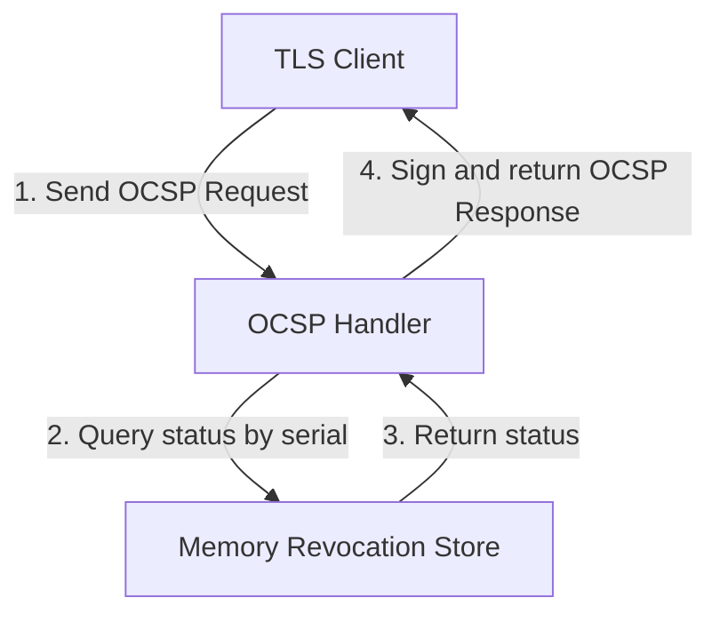

# Online Certificate Status Protocol (OCSP) Responder

This module implements the Online Certificate Status Protocol (OCSP) defined in RFC 6960. It allows clients to query the revocation status of a specific certificate in real time.

## Key Concepts

Certificate validation is a critical security step for clients establishing TLS connections. While Certificate Revocation Lists (CRLs) require downloading large files, OCSP provides a lightweight alternative.

1. **Real-time Status Query**: A client sends a binary request containing the serial number of the certificate. The responder checks the status and returns a signed response indicating whether the certificate is `Good`, `Revoked`, or `Unknown`.
2. **Revocation Store**: The responder relies on a data store to look up revocation records. We use an in-memory thread-safe store for this implementation.

## Implementation Structure

* `responder.go` defines the `RevocationStore` interface, the in-memory store implementation, and the HTTP handler that parses requests and issues signed OCSP responses.

## Further Reading References

* [RFC 6960: X.509 Internet Public Key Infrastructure Online Certificate Status Protocol (OCSP)](https://datatracker.ietf.org/doc/html/rfc6960)
* [Online Certificate Status Protocol Overview on Wikipedia](https://en.wikipedia.org/wiki/Online_Certificate_Status_Protocol)
* [Go x/crypto/ocsp Package Documentation](https://pkg.go.dev/golang.org/x/crypto/ocsp)
