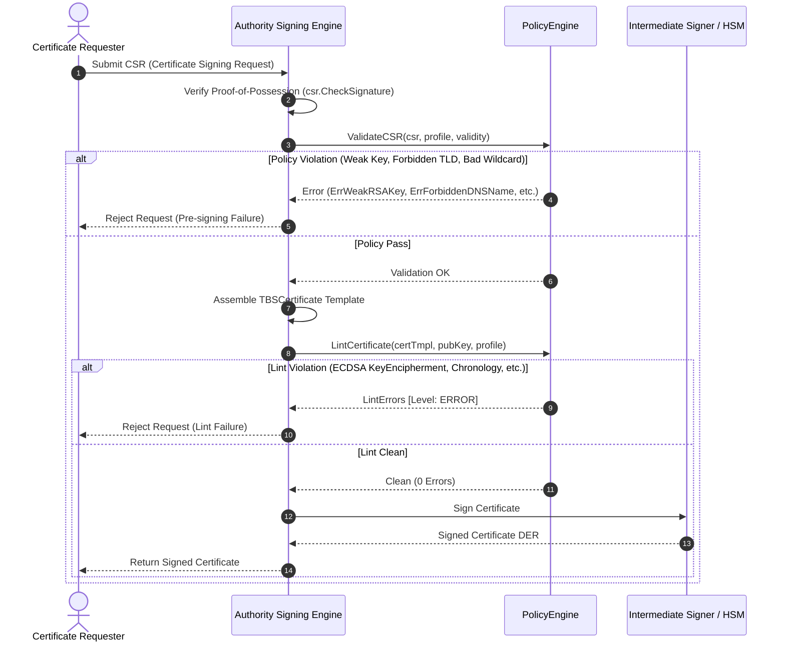

# Pre-Issuance Linting & Policy Enforcement (CA/B Forum & RFC 5280)

This document details the architectural principles and operational guarantees provided by the `PolicyEngine` and pre-issuance linting subsystem in `go-certa`.

---

## 1. Why Pre-Issuance Linting is Critical in WebPKI & Enterprise PKI

In modern Public Key Infrastructure, issuing an X.509 certificate with even a minor semantic or syntactic defect is treated as an incident of **misissuance**.

### 1.1 The High Cost of Misissuance & Mozilla Root Program Mandates
Under root program policies (such as the Mozilla Root Store Policy §6.1 and CA/Browser Forum Baseline Requirements):
- **24-Hour Mandate**: If a certificate is issued with a compromised key or misissued in a critical aspect (such as improper path length constraints or forbidden wildcard expansion), the CA **must revoke the certificate within 24 hours**.
- **5-Day Mandate**: Any non-critical syntactic flaw (such as an incorrect encoding of a validity date, missing standard extension, or extraneous KeyUsage flag) **mandates full revocation within 5 days**.
- **Public Scrutiny**: All publicly trusted certificates submitted to Certificate Transparency (CT) logs are continuously analyzed by automated linters (e.g., ZLint, Cablint). If an error is detected, the CA must publish a public Incident Report on Bugzilla explaining the root cause, remediation, and automated prevention measures.
- **Enterprise Risk**: In private / enterprise PKIs, invalid certificates can cause silent mTLS connection failures, VPN dropouts, and compliance audit failures.

### 1.2 Defense-in-Depth via `PolicyEngine`
Rather than discovering misissuance post-facto via CT monitors or customer complaints, `go-certa` embeds pre-issuance linting directly into the signing pipeline:



---

## 2. Deprecation of CommonName in Favor of SAN

### 2.1 The Vulnerability of CommonName
Historically (RFC 2459), hostnames were carried exclusively in the Subject Distinguished Name's `commonName` (CN) attribute:
```
Subject: CN=www.example.com, O=Acme, C=US
```
However:
- The `commonName` attribute has no strict syntactic validation rules, lacks support for Internationalized Domain Names (IDNs), cannot hold IP addresses cleanly, and is limited to 64 characters by X.500 directory standards.
- Ambiguities in how clients parsed Subject CN allowed chosen-prefix and null-byte injection attacks (`www.bank.com\0.attacker.com`).

### 2.2 Modern Standard (RFC 6125 & CABF BR §7.1.4.2.1)
RFC 6125, RFC 5280, and the CA/Browser Forum Baseline Requirements explicitly dictate:
- **`subjectAltName` is Authoritative**: Relying parties (browsers, curl, gRPC, Go TLS) **must** compare the target hostname exclusively against `dNSName` or `iPAddress` entries in the `subjectAltName` extension.
- **CommonName Deprecation**: The presence of `commonName` is either ignored or deprecated.
- **Enforcement**: `go-certa` enforces `RequireSAN=true` on all TLS server profiles. If a CSR attempts to rely solely on Subject CN without SAN entries, it is rejected immediately with `ErrSANRequired`.

---

## 3. Cryptographic Key Hygiene

`go-certa` enforces strict cryptographic thresholds before any signature is produced:

### 3.1 RSA Modulus Bit Length
- **Minimum 2048 Bits**: RSA keys with modulus lengths below 2048 bits (e.g., 512-bit or 1024-bit keys) are susceptible to practical factorization via number field sieve algorithms. The `PolicyEngine` rejects them with `ErrWeakRSAKey`.
- **Public Exponent Validation**: The public exponent $e$ must be an odd integer $\ge 65537$ to protect against low-exponent RSA attacks (e.g., Coppersmith, Hastad's broadcast attack).

### 3.2 Elliptic Curve Cryptography (ECC)
- **Approved Curves**: Only NIST curves with at least 256 bits of security are permitted:
  - `P-256` (`secp256r1` / `prime256v1`)
  - `P-384` (`secp384r1`)
  - `P-521`
  - Ed25519 (RFC 8410)
- **Curve Validation**: `IsOnCurve(X, Y)` is validated to defend against invalid curve attacks where an attacker provides coordinates not residing on the curve.

### 3.3 Algorithm-to-KeyUsage Alignment
A frequent source of X.509 lint failure is asserting KeyUsages that are cryptographically invalid for the public key algorithm:
- **`KeyEncipherment`**: Only valid for RSA keys (where the client encrypts a pre-master secret using the server's public key).
- **ECDSA & Ed25519**: Elliptic curve keys cannot encrypt data directly; they only perform digital signatures and key agreement (ECDH). Specifying `KeyEncipherment` on an ECDSA certificate violates RFC 5280 §4.2.1.3 and is flagged as a fatal `LintError` by the `PolicyEngine`.

---

## 4. Wildcard Domain Restrictions

To prevent over-broad domain impersonation:
1. **Leftmost Position Only**: Wildcard characters (`*`) must appear exclusively as the entire leftmost label (`*.example.com`). Embedded wildcards (e.g., `test*sub.example.com` or `sub.*.example.com`) are rejected with `ErrInvalidWildcard`.
2. **Public TLD Protection**: Wildcards cannot directly precede a top-level domain (e.g., `*.com`, `*.org`, `*.net`).
3. **Multiple Wildcard Ban**: Multiple asterisks (e.g., `*.*.example.com`) are forbidden.
