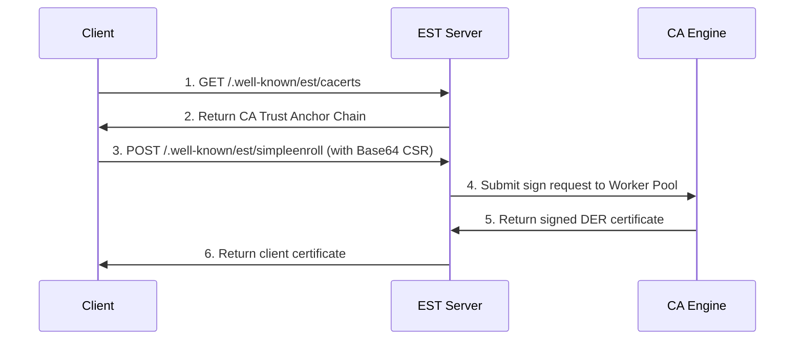
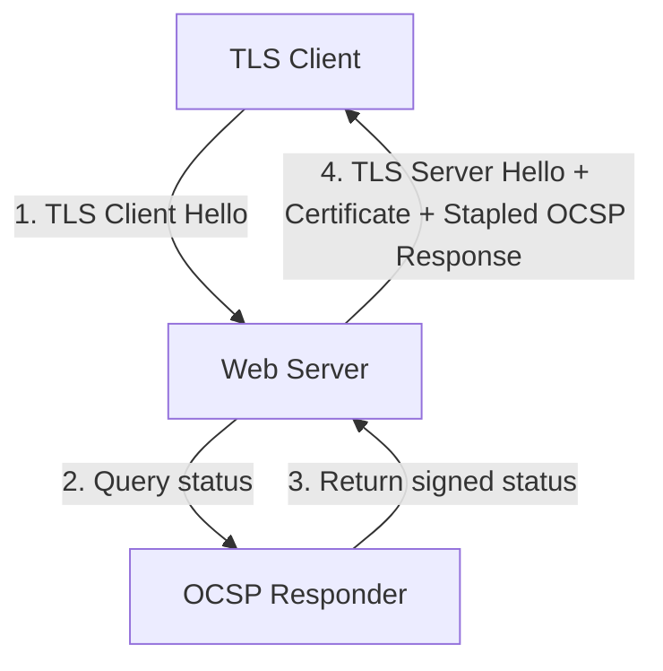

# Enrollment and Revocation Protocols

Certificate Authorities use automated protocols to issue, renew, and revoke certificates. This document explains the technical details of Enrollment over Secure Transport (EST), the Automatic Certificate Management Environment (ACME), and revocation validation systems.

---

## 1. Enrollment over Secure Transport (EST)

EST (defined in RFC 7030) is a protocol used for certificate management in network routers, switches, and internet of things (IoT) devices. It runs over HTTPS and relies on TLS client authentication or basic credentials.

### Primary Endpoints
* **`/.well-known/est/cacerts`**: Distributes the current CA trust chain to clients. This is the bootstrap step for new devices.
* **`/.well-known/est/simpleenroll`**: Accepts a Base64-encoded PKCS#10 CSR and returns the newly issued client certificate.
* **`/.well-known/est/simplereenroll`**: Used for renewing existing certificates. The client authenticates using its existing, valid certificate and submits a new CSR to receive a replacement.

---

## 2. Automatic Certificate Management Environment (ACME)

ACME (defined in RFC 8555) is the protocol behind Let's Encrypt. It enables web servers to automatically request and renew certificates without human intervention.

### The Issuance Workflow
1. **Account Creation**: The client contacts the ACME directory endpoint and generates an account key pair.
2. **Order Submission**: The client submits a request containing the hostnames it wants to protect.
3. **Challenges**: The ACME server responds with challenges to prove ownership of the domains.
4. **Finalization**: Once the challenges are verified, the client submits a CSR.
5. **Retrieval**: The ACME server issues the certificate and makes it available for download.

### Domain Validation Challenges
* **HTTP-01**: The client places a token file at a designated path on port 80 (e.g., `http://example.com/.well-known/acme-challenge/<token>`). The ACME server makes an HTTP request to retrieve it.
* **DNS-01**: The client creates a specific DNS TXT record under `_acme-challenge.example.com`. The ACME server queries DNS to verify its presence. This allows issuing wildcard certificates.

---

## 3. Revocation Validation Systems

If a private key is lost or compromised, the corresponding certificate must be invalidated before its expiration date.

### Certificate Revocation Lists (CRL)
A CRL is a list of revoked certificate serial numbers signed by the CA.

* **Distribution**: The certificate contains a `CRL Distribution Points` (CDP) extension pointing to the URL where the list is hosted.
* **Delta CRLs**: Large CAs issue Delta CRLs, which only contain changes since the last Base CRL. This reduces the download size.
* **Limitations**: High bandwidth usage and delayed updates. If a client caches a CRL for 24 hours, they will not see new revocations until the next download.

### Online Certificate Status Protocol (OCSP)
OCSP (defined in RFC 6960) provides real-time status checks.

* **Workflow**: The client sends a binary HTTP request with the certificate serial number. The OCSP responder returns a signed response indicating whether the certificate is `Good`, `Revoked`, or `Unknown`.
* **OCSP Stapling**: To prevent privacy concerns (the CA tracking which websites users visit) and connection latency, web servers can query the OCSP responder themselves. The web server then attaches (staples) the signed OCSP response directly to the TLS handshake.

---

## Further Reading References

* [RFC 7030: Enrollment over Secure Transport](https://datatracker.ietf.org/doc/html/rfc7030)
* [RFC 8555: Automatic Certificate Management Environment (ACME)](https://datatracker.ietf.org/doc/html/rfc8555)
* [RFC 6960: Online Certificate Status Protocol (OCSP)](https://datatracker.ietf.org/doc/html/rfc6960)
