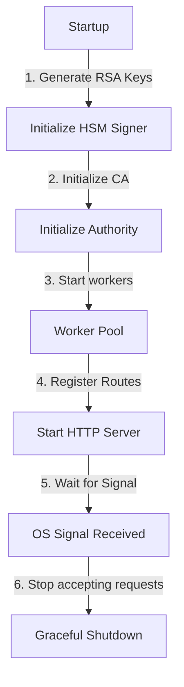

# Service Bootstrapping and Execution

This module wires all the individual components (the cryptographic signer, the worker pool, the CA engine, the OCSP responder, and the EST handler) into a single executable service. It handles startup, route registration, and graceful shutdown.

## Key Concepts

Putting the components together requires a clean bootstrapping flow.

1. **Dependency Injection**: The main application generates the necessary keys and injects dependencies down the stack. For instance, the HSM signer is passed to the CA Authority, and the Authority's certificate chain is passed to the EST and OCSP handlers.
2. **Graceful Shutdown**: When the service receives an operating system termination signal (like SIGINT or SIGTERM), it stops accepting new requests, allows active requests to complete, stops the worker pool, and terminates.

## Implementation Structure

* `main.go` runs the initialization steps, sets up HTTP routing, starts the server on port 8080, and listens for OS signals to trigger a graceful shutdown.

## Further Reading References

* [Go net/http Package Documentation](https://pkg.go.dev/net/http)
* [Graceful Shutdown of HTTP Server in Go](https://pkg.go.dev/net/http#Server.Shutdown)
* [RFC 7301: Transport Layer Security (TLS) Application-Layer Protocol Negotiation Extension](https://datatracker.ietf.org/doc/html/rfc7301)
