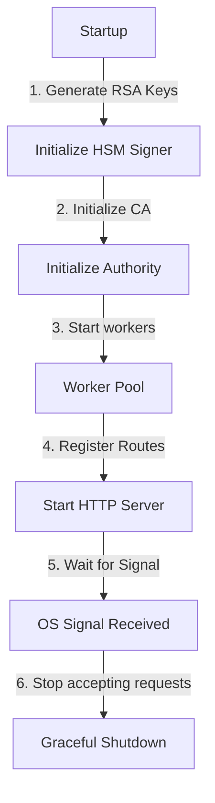

# Service Bootstrapping and Execution

This module wires all the individual components (the cryptographic signer, the worker pool, the CA engine, the OCSP responder, and the EST handler) into a single executable service. It handles startup, route registration, and graceful shutdown.

## Key Concepts

Putting the components together requires a clean bootstrapping flow.

1. **Dependency Injection**: The main application generates the necessary keys and injects dependencies down the stack. For instance, the HSM signer is passed to the CA Authority, and the Authority's certificate chain is passed to the EST and OCSP handlers.
2. **Graceful Shutdown**: When the service receives an operating system termination signal (like SIGINT or SIGTERM), it stops accepting new requests, allows active requests to complete, stops the worker pool, and terminates.

## Implementation Structure

* `main.go` runs the initialization steps, parses runtime flags and environment variables, sets up HTTP routing, starts the server, and listens for OS signals to trigger a graceful shutdown.
* `app.go` (`NewServerApp`) encapsulates all subsystem components, storage initialization, and standard library `http.ServeMux` route definitions.

## Authority Discovery & Certificate Endpoints

To provide standard interoperability with OpenSSL, browsers, EST clients, and ACME tooling, the server exposes the following endpoints:

| Route | Format | Description |
| :--- | :--- | :--- |
| `GET /ca/intermediate.crt` | Binary DER or PEM | Issuing Intermediate CA certificate (serves PEM if requested via `Accept: application/x-pem-file` or `?format=pem`) |
| `GET /ca/intermediate.pem` | Text PEM | Issuing Intermediate CA certificate in PEM format |
| `GET /ca/root.crt` | Binary DER | Root CA trust anchor certificate |
| `GET /ca/root.pem` | Text PEM | Root CA trust anchor certificate in PEM format |
| `GET /ca/chain.pem` | Text PEM | Combined trust chain (`Intermediate CA` + `Root CA`) for verification |

## Runtime Flags & Environment Variables

| Flag | Environment Variable | Default | Description |
| :--- | :--- | :--- | :--- |
| `--port <port>` | `CERTA_LISTEN_ADDR=:<port>` | `8080` | Port / address for the HTTP server |
| `--base-url <url>` | `CERTA_BASE_URL` | `http://localhost:8080` | Canonical public base URL for ACME, AIA, and CDP links |
| `--data-dir <dir>` | `CERTA_DATA_DIR` | `./data` | Directory for persistent SQLite DB, CA keys, and audit log. If `:memory:`, runs ephemeral. |
| `--allow-internal-domains` | `CERTA_ALLOW_INTERNAL_DOMAINS=true` | `false` | Permits issuing certificates for `.local`, `.internal`, `.lan`, `localhost`, etc. |
| `--skip-challenge-validation` | `CERTA_SKIP_CHALLENGE_VALIDATION=true` | `false` | Auto-accepts ACME `http-01` challenges without remote probing and enables internal domains |
| `--swagger` / `--debug` | `CERTA_ENABLE_SWAGGER=true` | `false` | Mounts local development Swagger UI at `/swagger/` and OpenAPI spec at `/swagger/doc.json` |

## Further Reading References

* [Go net/http Package Documentation](https://pkg.go.dev/net/http)
* [Graceful Shutdown of HTTP Server in Go](https://pkg.go.dev/net/http#Server.Shutdown)
* [RFC 7301: Transport Layer Security (TLS) Application-Layer Protocol Negotiation Extension](https://datatracker.ietf.org/doc/html/rfc7301)
