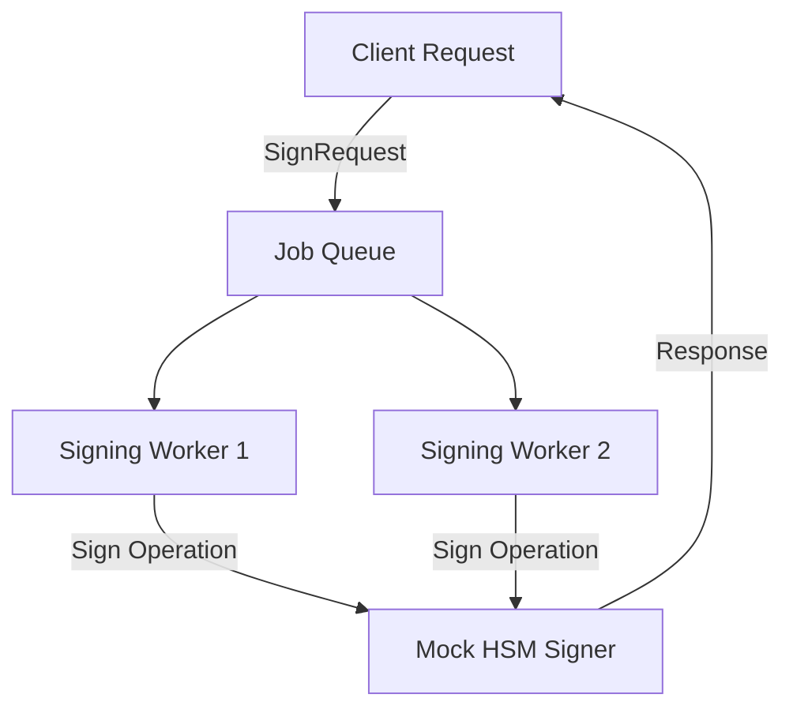

# Cryptographic Signer and HSM Simulation

This module handles the private keys used for signing certificates. In production environments, these keys are stored in Hardware Security Modules (HSMs) to prevent unauthorized extraction. We abstract this using Go's standard library interfaces and manage signing requests using a concurrent worker pool.

## Key Concepts

Private key operations are computationally expensive and represent a sensitive target. We use two main components to manage these operations.

1. **Hardware Security Module Abstraction**: The `HSMSigner` implements the standard `crypto.Signer` interface. This allows the application to interact with simulated cryptographic hardware that introduces realistic execution latency.
2. **Concurrency Control**: A dedicated worker pool processes signing requests. This design prevents high traffic volumes from overloading the cryptographic hardware.

## Implementation Structure

* `mock_hsm.go` simulates the physical HSM with configurable delay.
* `pool.go` controls the queue size and the number of active workers processing signing operations.

## Further Reading References

* [Go crypto.Signer Interface Documentation](https://pkg.go.dev/crypto#Signer)
* [Hardware Security Module Overview on Wikipedia](https://en.wikipedia.org/wiki/Hardware_security_module)
* [RFC 5280: Section 6 - Certification Path Validation](https://datatracker.ietf.org/doc/html/rfc5280#section-6)
