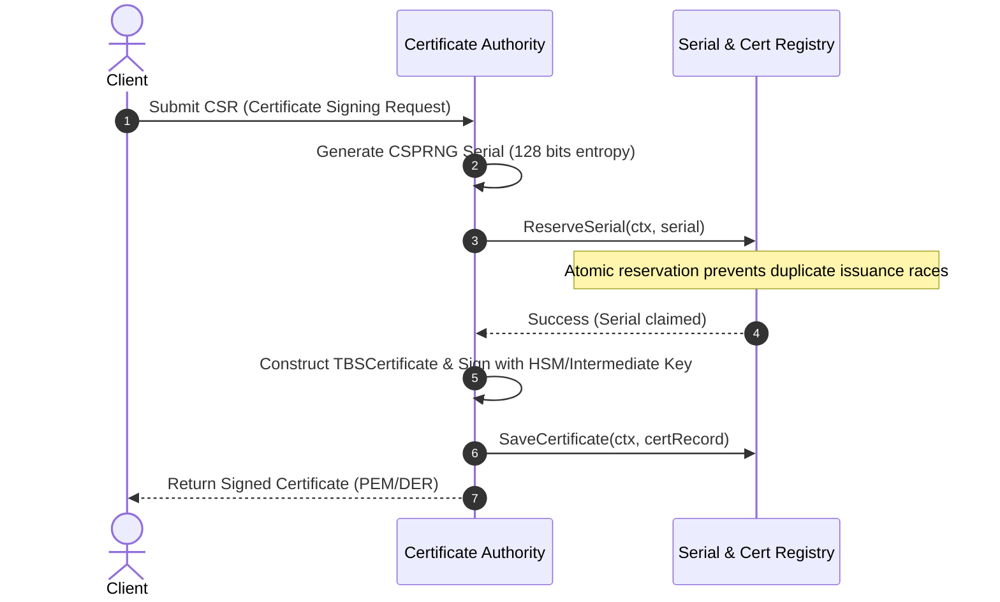

# Persistent Storage, Domain Models & RFC 5280 Serial Generator

This document details the architecture and cryptographic rationale behind the `pkg/storage` and `pkg/ca` serial generation modules in `go-certa`.

---

## 1. RFC 5280 & CA/B Forum Serial Number Requirements

### 1.1 Specification Constraints
According to **RFC 5280 §4.1.2.2**:
- The serial number MUST be a positive integer assigned by the CA to each certificate.
- It MUST be unique for each certificate issued by a given CA (i.e., the issuer name and serial number identify a unique certificate).
- Conforming CAs MUST NOT use `serialNumber` values longer than 20 octets (160 bits).
- Non-negative integer representation in ASN.1 DER uses two's complement encoding. If the most significant bit (MSB) of an integer's first octet is set (`1`), a leading zero octet (`0x00`) is prepended to preserve sign positivity. Consequently, to ensure the DER encoding strictly never exceeds 20 octets, the maximum bit length of the generated random integer is **159 bits**.

According to **CA/Browser Forum Baseline Requirements §7.1**:
- CAs SHALL generate non-sequential Certificate serial numbers greater than zero (`0`) containing at least **64 bits of output from a CSPRNG** (`crypto/rand`).

### 1.2 The Danger of Sequential Serials: Chosen-Prefix Collision Attacks
Historically, many Certificate Authorities generated sequential, predictable serial numbers (`1, 2, 3...` or timestamps plus increments). This practice directly enabled practical cryptographic forgery:

1. **The 2008 Rogue CA Attack (Sotirov, Stevens et al.)**:
   - Researchers demonstrated that predictable certificate fields (serial numbers and validity dates) combined with collision vulnerabilities in MD5 allowed an attacker to create a rogue Certificate Authority certificate.
   - Because the CA used sequential serial numbers and predictable `notBefore` timestamps, the researchers predicted the exact header bytes of a certificate that would be signed days in advance.
   - Using a **chosen-prefix collision attack**, they precomputed two payloads (one for a benign end-entity website, and one for a rogue intermediate CA) that produced identical MD5 hashes despite differing payloads.
   - The commercial CA signed the legitimate request, and the researchers transplanted that valid signature onto their rogue CA certificate, enabling them to issue valid certificates for any domain.
2. **Flame Malware (2012)**:
   - The Flame cyber-espionage malware used an MD5 chosen-prefix collision against Microsoft's Terminal Server licensing CA (which also issued predictable serial numbers) to sign fraudulent Windows update binaries.

### 1.3 How CSPRNG Entropy Mitigates Collision Attacks
Injecting at least 64 bits (and up to 128–159 bits) of unpredictable entropy generated from a CSPRNG (`crypto/rand`) before the certificate TBS (*To-Be-Signed*) structure is signed completely neutralizes chosen-prefix attacks:
- The attacker cannot predict the serial number in advance.
- Chosen-prefix collisions require knowing the prefix of the message before calculating near-collision blocks.
- When the CA injects fresh random entropy into the serial number early in the ASN.1 sequence, any precomputed collision blocks become completely invalid.



---

## 2. Storage Engine Architecture (`pkg/storage`)

The storage package abstracts persistence through a modular interface, decoupling the signing logic from the underlying storage mechanism.

### 2.1 Domain Models
- **`CertificateRecord`**: Persists the full certificate along with operational index fields:
  - `Serial string`: Canonical lowercase hexadecimal representation of the certificate serial.
  - `Subject string`: RFC 2253 / string representation of the certificate Subject DN.
  - `Issuer string`: Distinguishing name of the issuing CA.
  - `NotBefore time.Time`, `NotAfter time.Time`: Certificate validity window.
  - `RawDER []byte`: Binary ASN.1 DER encoded certificate.
  - `PEM []byte`: ASCII armored PEM certificate representation.
  - `Revoked bool`: Boolean revocation status flag for high-speed filter lookups.
- **`RevocationRecord`**: Revocation tracking compliant with RFC 5280:
  - `Serial string`: Target certificate serial number.
  - `RevokedAt time.Time`: UTC timestamp of revocation.
  - `Reason int`: RFC 5280 §5.3.1 CRLReason code (e.g., `1` for `keyCompromise`, `4` for `superseded`).
- **`SerialRecord`**:
  - `Serial string`: Reserved or issued serial identifier.
  - `IssuedAt time.Time`: Allocation timestamp.

### 2.2 Storage Interface Contract
```go
type Storage interface {
    SaveCertificate(ctx context.Context, cert *CertificateRecord) error
    GetCertificate(ctx context.Context, serial string) (*CertificateRecord, error)
    RevokeCertificate(ctx context.Context, serial string, reason int, revokedAt time.Time) error
    GetRevocation(ctx context.Context, serial string) (*RevocationRecord, error)
    ListRevoked(ctx context.Context) ([]*RevocationRecord, error)
    ReserveSerial(ctx context.Context, serial string) error
}
```

### 2.3 Sentinel Errors
All implementations return standard sentinel errors for predictable error handling:
- `ErrNotFound`: The requested certificate, revocation, or serial does not exist.
- `ErrAlreadyExists`: Attempted to insert a duplicate certificate or claim an already reserved serial.
- `ErrAlreadyRevoked`: The certificate has already been revoked.
- `ErrInvalidInput`: The input parameter is nil, empty, or malformed.

---

## 3. Concurrency, Immutability & Idempotency

### 3.1 In-Memory Engine (`MemoryStorage`)
`MemoryStorage` implements `Storage` using fine-grained reader/writer locking (`sync.RWMutex`):
- **Read Operations (`GetCertificate`, `GetRevocation`, `ListRevoked`)**: Acquire read locks (`RLock`), allowing high-throughput concurrent reads for OCSP and CRL responders.
- **Write Operations (`SaveCertificate`, `RevokeCertificate`, `ReserveSerial`)**: Acquire exclusive write locks (`Lock`) ensuring state integrity.
- **Defensive Deep Copying**: All records and internal byte slices (`RawDER`, `PEM`) are copied on both insertion and retrieval. Callers cannot mutate internal store state or induce data races.

### 3.2 Two-Phase Serial Reservation & Idempotency
In high-concurrency environments or distributed issuance clusters:
1. **Pre-issuance Reservation**: `ReserveSerial` atomically locks a serial prior to expensive cryptographic signing operations. If two workers randomly pick the same serial (probability $\approx 10^{-38}$ for 128-bit serials), one fails immediately with `ErrAlreadyExists` and automatically retries with fresh entropy.
2. **Finalization**: `SaveCertificate` records the final certificate record.
3. **Idempotent Revocation Handling**: Calling `RevokeCertificate` on an already revoked certificate returns `ErrAlreadyRevoked` to prevent silent timestamp overwrites or audit tampering.

---

## 4. Extensibility to Relational Backends (SQLite / PostgreSQL)

The `Storage` interface is designed to map directly to relational schemas:

```sql
CREATE TABLE certificates (
    serial VARCHAR(40) PRIMARY KEY,
    subject TEXT NOT NULL,
    issuer TEXT NOT NULL,
    not_before TIMESTAMP WITH TIME ZONE NOT NULL,
    not_after TIMESTAMP WITH TIME ZONE NOT NULL,
    raw_der BYTEA NOT NULL,
    pem TEXT NOT NULL,
    revoked BOOLEAN NOT NULL DEFAULT FALSE
);

CREATE TABLE revocations (
    serial VARCHAR(40) PRIMARY KEY REFERENCES certificates(serial),
    revoked_at TIMESTAMP WITH TIME ZONE NOT NULL,
    reason INTEGER NOT NULL
);

CREATE TABLE serials (
    serial VARCHAR(40) PRIMARY KEY,
    issued_at TIMESTAMP WITH TIME ZONE NOT NULL
);
```
