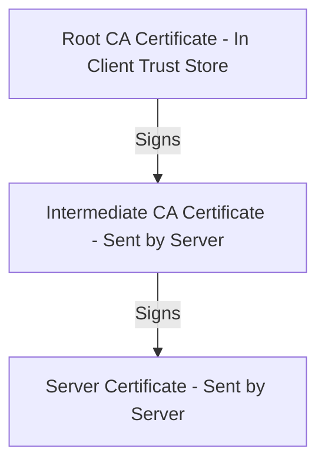

# PKI Trust Hierarchy and X.509 Certificates

A Public Key Infrastructure (PKI) manages the lifecycle of digital certificates. This document explains how certificates are structured, how trust chains are validated, and the administrative controls surrounding Root CAs.

---

## 1. The Structure of an X.509 v3 Certificate

An X.509 certificate is a signed data structure that binds a public key to an identity. The format is defined in RFC 5280.

```
┌────────────────────────────────────────────────────────┐
│ Certificate Fields                                     │
├────────────────────────────────────────────────────────┤
│ Version, Serial Number, Signature Algorithm            │
│ Issuer Distinguished Name (DN)                         │
│ Validity Period (Not Before / Not After)               │
│ Subject Distinguished Name (DN)                        │
│ Subject Public Key Info                                │
│ Extensions: SAN, Key Usage, Basic Constraints          │
├────────────────────────────────────────────────────────┤
│ CA Signature (Signs all the fields above)             │
└────────────────────────────────────────────────────────┘
```

### Core Fields
* **Serial Number**: A unique integer assigned by the CA. This is used to track and revoke the certificate.
* **Issuer**: The identity of the CA that signed the certificate.
* **Subject**: The identity of the owner of the certificate (e.g., a domain name or a device identifier).
* **Validity Period**: The start (`NotBefore`) and end (`NotAfter`) times. Browsers reject certificates if the current time is outside this window.
* **Subject Public Key Info**: The public key itself along with the algorithm type (e.g., RSA 2048).

### Critical Extensions
* **Basic Constraints**: Indicates whether the certificate belongs to a CA (meaning it can sign other certificates) or an end entity. It also defines the path length constraint, which limits how many subordinate CAs can follow.
* **Key Usage**: Defines the cryptographic operations allowed (e.g., Digital Signature, Key Encipherment, Certificate Signing).
* **Extended Key Usage (EKU)**: Defines specific applications for the key (e.g., Server Authentication, Client Authentication, Code Signing).
* **Subject Alternative Name (SAN)**: Lists the hostnames or IP addresses the certificate protects. Modern browsers ignore the old `Common Name` field and require SAN validation.

---

## 2. Chain Building and Path Validation

When a client connects to a server, the server sends a chain of certificates. The client must validate this chain up to a trusted root certificate.



### Path Validation Rules
1. **Signature Verification**: Each certificate's signature is verified using the public key of the issuing certificate above it.
2. **Temporal Checks**: The client checks that all certificates in the chain are currently within their validity periods.
3. **Constraint Validation**: The client verifies that only CA certificates were allowed to sign other certificates, and that path length limits were not exceeded.
4. **Revocation Verification**: The client checks if any certificate in the chain has been revoked using CRLs or OCSP queries.
5. **Name Constraints**: The client ensures that intermediate CAs did not sign certificates for domains outside their authorized scopes.

---

## 3. Operational Roles and Key Ceremonies

Operating a CA requires strict administrative controls to protect the integrity of the trust anchor.

### Root CAs
The Root CA represents the top of the trust tree. 
* **Key Storage**: The private key is stored in a physical, offline Hardware Security Module (HSM) located inside a high-security vault.
* **Access Control**: Using the private key requires physical access, multiple physical keys held by different individuals, and a strict quorum (e.g., 3 out of 5 designated security officers).
* **Usage**: The Root CA key is only powered on during a **Key Ceremony** to sign intermediate CAs or issue a Root CRL.

### Intermediate CAs
Intermediate CAs are subordinate CAs signed by the Root.
* **Key Storage**: The private key lives in an online HSM connected to the network.
* **Function**: Processes online requests from ACME or EST systems and signs end-entity certificates.
* **Isolation**: If an online Intermediate CA is compromised, the Root CA can revoke it. The Root CA remains secure because it was offline and untouched.

---

## Further Reading References

* [RFC 5280: Internet X.509 Public Key Infrastructure Certificate Profile](https://datatracker.ietf.org/doc/html/rfc5280)
* [CA/Browser Forum Baseline Requirements](https://cabforum.org/baseline-requirements-documents/)
* [The Anatomy of a Web Trust Chain on Let's Encrypt](https://letsencrypt.org/certificates/)
